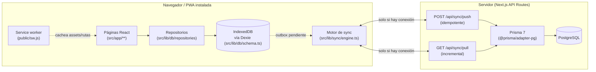

# ARCHITECTURE.md

Este documento describe **cómo está construido lo que ya existe** (Fase 1).
Para la arquitectura objetivo completa del proyecto (todas las fases,
modelo de datos completo, riesgos) ver [`IMPLEMENTATION_PLAN.md`](./IMPLEMENTATION_PLAN.md).
Para el detalle específico de offline/sincronización, con diagramas, ver
[`OFFLINE_SYNC.md`](./OFFLINE_SYNC.md).

## 1. Visión general

Principio rector: **toda pantalla lee y escribe primero contra IndexedDB**.
La red solo entra en juego en segundo plano, a través del motor de
sincronización, y su ausencia nunca bloquea ni degrada la experiencia
(ver §5 y §6 de `IMPLEMENTATION_PLAN.md`).

## 2. Capas y responsabilidades

### `src/lib/db/` — datos locales

- `schema.ts`: define `AppDatabase extends Dexie` con las tablas
  `species`, `ponds`, `syncQueue`, `syncMeta`, versionadas explícitamente
  (`this.version(1).stores(...)`). Cualquier cambio de esquema futuro
  agrega una nueva versión, nunca modifica la existente, para no perder
  datos de dispositivos que llevaban tiempo sin sincronizar.
- `types.ts`: tipos de dominio (`SpeciesRecord`, `PondRecord`,
  `SyncQueueRecord`, ...), independientes del cliente Prisma generado —
  el navegador nunca importa código orientado a Node.
- `deviceId.ts` / `uuid.ts`: identificador de instalación persistente
  (`localStorage`) y generación de UUID v4 en el dispositivo para toda
  entidad nueva.
- `repositories/base.ts`: capa de acceso a datos común. `createRecord`,
  `updateRecord` y `softDeleteRecord` envuelven **en una sola transacción
  Dexie** la escritura del registro de dominio y la entrada
  correspondiente en `syncQueue` — nunca queda un cambio guardado sin su
  operación de sincronización encolada, ni viceversa.
- `repositories/speciesRepository.ts` / `pondRepository.ts`: API
  específica de cada entidad sobre esa base común.
- `repositories/syncQueueRepository.ts`: lectura/escritura de la cola de
  sincronización y de `syncMeta` (cursor `lastSyncedAt`), usado solo por
  el motor de sync, nunca por la UI directamente.

### `src/lib/sync/` — sincronización cliente

- `client.ts`: llamadas HTTP delgadas a `/api/sync/push` y
  `/api/sync/pull`. Sin lógica de reintentos.
- `status.ts`: store observable minimalista (`getSyncStatus`,
  `subscribeSyncStatus`, `setSyncStatus`) consumido con
  `useSyncExternalStore` desde React.
- `engine.ts`: orquesta un ciclo de sincronización (`runSync`) — ver
  `OFFLINE_SYNC.md` para el flujo completo — y expone `startSyncEngine()`
  para conectar los disparadores automáticos (apertura de la app, evento
  `online`, intervalo periódico).

### `src/lib/validation/sync.ts` — validación compartida

Esquemas Zod para el protocolo de sincronización, usados tanto en el
cliente (antes de construir el payload) como en el servidor (`/api/sync/push`
nunca confía en que el cliente ya validó). Un mismo esquema, dos usos.

### `src/lib/server/prisma.ts` — cliente de base de datos

Singleton de `PrismaClient` con el driver adapter `@prisma/adapter-pg`
(requerido por Prisma 7 para PostgreSQL — ver la nota de arquitectura en
`IMPLEMENTATION_PLAN.md` §4.4.1). Solo se importa desde código de
servidor (API routes).

### `src/app/api/sync/` — API de sincronización

- `push/route.ts`: valida con Zod, aplica cada operación en una
  transacción Prisma, y usa `operationId` (único en `SyncOperation`) como
  clave de idempotencia — ver `OFFLINE_SYNC.md` §3.
- `pull/route.ts`: entrega cambios posteriores a `?since=`, calculando su
  propio cursor (`serverTime`) antes de leer, para que el cliente nunca
  dé por sincronizado un cambio que llegó a mitad de la consulta.
- `_lib/applyOperation.ts`: aplica CREATE/UPDATE/DELETE con resolución de
  conflictos last-write-wins por número de versión.

### `src/app/` — UI

- `layout.tsx`: shell raíz (español, metadata, `SyncProvider` +
  `ServiceWorkerRegister` + `InstallPrompt` montados una vez).
- `page.tsx`: dashboard con conteos en vivo (`useLiveQuery` sobre Dexie).
- `especies/page.tsx`, `estanques/page.tsx`: registro rápido (formulario
  mínimo) + lista en vivo, pensados para completarse en segundos desde un
  teléfono (§75 del encargo).
- `manifest.ts`, `icons/[size]/route.tsx`: metadatos de PWA (ver
  `IMPLEMENTATION_PLAN.md` §7).

### `src/components/`

- `layout/AppShell.tsx`: header con el badge de sincronización + navegación inferior mobile-first.
- `sync/SyncStatusBadge.tsx`: indicador 🟢/🟠/🔴/⚫ + botón "Sincronizar ahora".
- `sync/SyncProvider.tsx`: arranca el motor de sync una vez para toda la app.
- `pwa/ServiceWorkerRegister.tsx`, `pwa/InstallPrompt.tsx`: registro del service worker y aviso discreto de instalación.

## 3. Modelo de datos actual

Solo se implementaron las entidades mínimas para demostrar la
arquitectura de punta a punta (`prisma/schema.prisma`):

- **`Species`** — catálogo de especies.
- **`Pond`** — estanques.
- **`SyncOperation`** — registro de operaciones de sync procesadas por el
  servidor; `operationId` es la clave de idempotencia.

Todas las entidades sincronizables comparten los mismos campos de
auditoría (`createdAt`, `updatedAt`, `deletedAt`, `version`, `deviceId`,
`createdBy`, `updatedBy`) tanto en Prisma como en Dexie, con los mismos
nombres — el mapeo entre ambos lados es directo. El modelo de datos
completo del dominio piscícola (lotes, alimentación, mortalidad,
muestreos, ventas...) está documentado en `IMPLEMENTATION_PLAN.md` §4 y
se implementa de forma incremental en las siguientes fases.

## 4. Decisiones de arquitectura tomadas durante la Fase 1

Estas decisiones surgieron al implementar (no estaban en el plan
original) y quedan documentadas aquí y en `IMPLEMENTATION_PLAN.md` para
que no se repitan las mismas dudas en fases futuras:

1. **Prisma 7 requiere un driver adapter explícito** (`@prisma/adapter-pg`)
   y mueve la URL de conexión de `schema.prisma` a `prisma.config.ts`. Ver
   `IMPLEMENTATION_PLAN.md` §4.4.1.
2. **Sin `@serwist/next`**: inyecta un hook de webpack en `next.config`,
   incompatible con Turbopack (por defecto en Next 16 tanto en `dev` como
   en `build`). Se implementó un service worker propio, documentado línea
   por línea en `public/sw.js`. Ver `IMPLEMENTATION_PLAN.md` §7.
3. **TypeScript 5.9.3, no 7.0.2**: `typescript-eslint` no soporta TS 7.0
   todavía (falla al cargar, no es una precaución). Ver `IMPLEMENTATION_PLAN.md` §3.3.
4. **ESLint 9.39.5, no 10.10.0**: las dependencias anidadas reales de
   `eslint-config-next` (`eslint-plugin-react`, `eslint-plugin-jsx-a11y`,
   `eslint-plugin-import`) todavía no soportan ESLint 10 en la práctica.
   Ver `IMPLEMENTATION_PLAN.md` §3.3.
5. **`navigator.onLine` no es suficiente**: puede seguir reportando
   `true` justo después de un corte de red real. El motor de sync también
   infiere "sin conexión" de que `fetch()` lance `TypeError` (la señal
   real de fallo de red, a diferencia de una respuesta HTTP de error).
6. **El comportamiento offline se verifica contra un build de
   producción**, nunca contra `next dev` — ver la nota en `README.md` y
   en `IMPLEMENTATION_PLAN.md` §11.

## 5. Qué NO está implementado todavía

Deliberadamente fuera de alcance de la Fase 1 (ver `IMPLEMENTATION_PLAN.md`
§9 para el orden de las fases siguientes): lotes, siembras, traslados,
alimentación, inventario, mortalidad, muestreos, calidad de agua, tareas,
calendario, proveedores, compradores, cosechas, ventas, rentabilidad,
informes, autenticación, roles de usuario, gráficos, exportación a
PDF/CSV, notificaciones push, y el aviso interactivo "nueva versión
disponible" del service worker (por ahora se actualiza solo, sin avisar).
