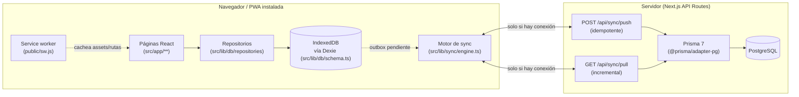

# ARCHITECTURE.md

Este documento describe **cómo está construido lo que ya existe** (Fases
1 y 2). Para la arquitectura objetivo completa del proyecto (todas las
fases, modelo de datos completo, riesgos) ver [`IMPLEMENTATION_PLAN.md`](./IMPLEMENTATION_PLAN.md).
Para el detalle específico de offline/sincronización, con diagramas, ver
[`OFFLINE_SYNC.md`](./OFFLINE_SYNC.md) — incluida su §8, con el modelo de
lotes/siembras/traslados de la Fase 2.

## 1. Visión general

Principio rector: **toda pantalla lee y escribe primero contra IndexedDB**.
La red solo entra en juego en segundo plano, a través del motor de
sincronización, y su ausencia nunca bloquea ni degrada la experiencia
(ver §5 y §6 de `IMPLEMENTATION_PLAN.md`).

## 2. Capas y responsabilidades

### `src/lib/domain/` — dominio puro (Fase 2)

Funciones puras, sin dependencias de Dexie ni de Prisma, importadas por
igual desde el cliente (repositorios) y el servidor
(`_lib/applyOperation.ts`) para que la regla de negocio sea exactamente
una, nunca dos implementaciones que puedan divergir:

- `batchLedger.ts`: cálculo de dónde está un lote (`getBatchPondBalance`,
  `getBatchDistribution`, `getBatchTotalBalance`, `getPondOccupancy`) a
  partir de sus eventos de siembra/traslado — nunca de un campo mutable.
  Ver `OFFLINE_SYNC.md` §8.1.
- `biomass.ts`: `calculateBiomassKg(cantidad, pesoPromedioG)`.
- `batchCode.ts`: código de lote único generable offline (especie + año +
  secuencia local + sufijo de dispositivo). Ver `OFFLINE_SYNC.md` §8.4.
- `pondGeometry.ts`: estado calculado-vs-manual de área/volumen de un
  estanque a partir de largo/ancho/profundidad, sin sobrescribir un valor
  manual sin avisar.

### `src/lib/db/` — datos locales

- `schema.ts`: define `AppDatabase extends Dexie` con las tablas
  `species`, `ponds`, `fishBatches`, `stockings`, `fishTransfers`,
  `syncQueue`, `syncMeta`, versionadas explícitamente
  (`this.version(1).stores(...)`, `this.version(2).stores(...)`).
  Cualquier cambio de esquema agrega una nueva versión, nunca modifica
  la existente, para no perder datos de dispositivos que llevaban tiempo
  sin sincronizar — la v2 de la Fase 2 se probó explícitamente contra una
  base con datos de la v1 ya presentes (`schemaUpgrade.test.ts`).
- `types.ts`: tipos de dominio (`SpeciesRecord`, `PondRecord`,
  `FishBatchRecord`, `StockingRecord`, `FishTransferRecord`, ...),
  independientes del cliente Prisma generado — el navegador nunca importa
  código orientado a Node.
- `deviceId.ts` / `uuid.ts`: identificador de instalación persistente
  (`localStorage`) y generación de UUID v4 en el dispositivo para toda
  entidad nueva.
- `repositories/base.ts`: capa de acceso a datos común. `createRecord`,
  `updateRecord` y `softDeleteRecord` envuelven **en una sola transacción
  Dexie** la escritura del registro de dominio y la entrada
  correspondiente en `syncQueue` — nunca queda un cambio guardado sin su
  operación de sincronización encolada, ni viceversa. `createEventRecord`
  es la variante para entidades *append-only* (`Stocking`,
  `FishTransfer`): sin `version`, sin actualización posible.
- `repositories/speciesRepository.ts` / `pondRepository.ts`: API
  específica de cada entidad sobre esa base común. `pondRepository`
  integra `applyPondGeometryPatch` para el modo calculado/manual de
  área y volumen.
- `repositories/fishBatchRepository.ts`: `createFishBatchWithStocking`
  crea el lote **y** su siembra inicial en una única transacción Dexie —
  nunca queda un lote a medias si falla una parte (§8.1 del encargo de
  Fase 2).
- `repositories/fishTransferRepository.ts`: `createFishTransfer` valida
  el balance disponible contra `getBatchPondBalance` **antes** de
  escribir — ver `OFFLINE_SYNC.md` §8.2.
- `repositories/ledgerQueries.ts`: consultas de solo lectura sobre el
  ledger para la UI (`getBatchDistribution`, `getBatchHistory`,
  `getPondOccupancy`, `getPondHistory`).
- `repositories/syncQueueRepository.ts`: lectura/escritura de la cola de
  sincronización y de `syncMeta` (cursor `lastSyncedAt`), usado solo por
  el motor de sync, nunca por la UI directamente.

### `src/lib/sync/` — sincronización cliente

- `client.ts`: llamadas HTTP delgadas a `/api/sync/push` y
  `/api/sync/pull`. Sin lógica de reintentos.
- `status.ts`: store observable minimalista (`getSyncStatus`,
  `subscribeSyncStatus`, `setSyncStatus`) consumido con
  `useSyncExternalStore` desde React.
- `engine.ts`: orquesta un ciclo de sincronización (`runSync`) — ver
  `OFFLINE_SYNC.md` para el flujo completo — y expone `startSyncEngine()`
  para conectar los disparadores automáticos (apertura de la app, evento
  `online`, intervalo periódico).

### `src/lib/validation/sync.ts` — validación compartida

Esquemas Zod para el protocolo de sincronización, usados tanto en el
cliente (antes de construir el payload) como en el servidor (`/api/sync/push`
nunca confía en que el cliente ya validó). Un mismo esquema, dos usos.

### `src/lib/server/prisma.ts` — cliente de base de datos

Singleton de `PrismaClient` con el driver adapter `@prisma/adapter-pg`
(requerido por Prisma 7 para PostgreSQL — ver la nota de arquitectura en
`IMPLEMENTATION_PLAN.md` §4.4.1). Solo se importa desde código de
servidor (API routes).

### `src/app/api/sync/` — API de sincronización

- `push/route.ts`: valida con Zod, aplica cada operación en una
  transacción Prisma, y usa `operationId` (único en `SyncOperation`) como
  clave de idempotencia — ver `OFFLINE_SYNC.md` §3.
- `pull/route.ts`: entrega cambios posteriores a `?since=`, calculando su
  propio cursor (`serverTime`) antes de leer, para que el cliente nunca
  dé por sincronizado un cambio que llegó a mitad de la consulta. Desde
  la Fase 2 también entrega `fishBatches`, `stockings` y `fishTransfers`
  (estos dos últimos filtrados por `createdAt`, no `updatedAt`: son
  append-only, nunca se actualizan).
- `_lib/applyOperation.ts`: aplica CREATE/UPDATE/DELETE con resolución de
  conflictos last-write-wins por número de versión para `Species`/`Pond`/
  `FishBatch`. Para `FishTransfer` aplica además la validación de
  balance con bloqueo de concurrencia (`pg_advisory_xact_lock`) descrita
  en `OFFLINE_SYNC.md` §8.3 — un traslado que dejaría el origen negativo
  vuelve `status: "conflict"` en vez de aplicarse.

### `src/app/` — UI

- `layout.tsx`: shell raíz (español, metadata, `SyncProvider` +
  `ServiceWorkerRegister` + `InstallPrompt` montados una vez).
- `page.tsx`: dashboard con conteos en vivo (`useLiveQuery` sobre Dexie):
  estanques activos, lotes activos, peces sembrados (vía
  `getBatchTotalBalance`) y biomasa inicial disponible. Deliberadamente
  sin analítica compleja todavía (§36 del encargo de Fase 2).
- `especies/page.tsx`: registro rápido (formulario mínimo) + lista en
  vivo, pensado para completarse en segundos desde un teléfono (§75 del
  encargo de Fase 1).
- `estanques/page.tsx` + `estanques/nuevo/page.tsx` + `estanques/[id]/page.tsx`:
  listado con superficie/volumen/lotes (derivado de `getPondOccupancy`,
  nunca guardado); alta con geometría calculada-vs-manual
  (`PondGeometryFields`); ficha con edición de geometría in situ,
  producción actual y el historial de siembras/traslados que involucran
  ese estanque (`getPondHistory`).
- `lotes/page.tsx` + `lotes/nuevo/page.tsx` + `lotes/[id]/page.tsx`:
  listado con ubicación derivada (`getBatchDistribution`); alta
  transaccional de lote + siembra inicial con preview de biomasa; ficha
  con distribución actual por estanque, el formulario de "Traslado
  rápido" (preview Disponibles/Trasladar/Quedarán, ver
  `OFFLINE_SYNC.md` §8.2) e historial combinado de siembras y traslados.
- `manifest.ts`, `icons/[size]/route.tsx`: metadatos de PWA (ver
  `IMPLEMENTATION_PLAN.md` §7).

### `src/components/`

- `layout/AppShell.tsx`: header con el badge de sincronización +
  navegación inferior mobile-first (Inicio, Especies, Lotes, Estanques).
- `sync/SyncStatusBadge.tsx`: indicador 🟢/🟠/🔴/⚫ + botón "Sincronizar ahora".
- `sync/SyncProvider.tsx`: arranca el motor de sync una vez para toda la app.
- `pwa/ServiceWorkerRegister.tsx`, `pwa/InstallPrompt.tsx`: registro del service worker y aviso discreto de instalación.
- `ponds/PondGeometryFields.tsx`: campos de largo/ancho/profundidad →
  área/volumen calculados o manuales, con "Recalcular" explícito —
  nunca sobrescribe un valor manual en silencio.

## 3. Modelo de datos actual

`prisma/schema.prisma` (Fases 1 y 2):

- **`Species`** — catálogo de especies productivo: nombre, peso objetivo,
  ciclo estimado, rangos de temperatura/pH/oxígeno, FCR y mortalidad
  esperados.
- **`Pond`** — estanques: código, nombre, geometría (largo/ancho/
  profundidad → área/volumen, cada uno `CALCULATED` o `MANUAL`), estado
  (`PondStatus`), activo/inactivo (soft-delete).
- **`FishBatch`** — lote productivo: especie, siembra inicial (fecha,
  cantidad, peso promedio, biomasa), costo de alevines, estado
  (`BatchStatus`). **Nunca** guarda un estanque ni una cantidad "actual"
  — ver `OFFLINE_SYNC.md` §8.1.
- **`Stocking`** — evento de siembra (append-only): lote, estanque,
  fecha, cantidad, peso/biomasa. Es la única forma de que un lote entre
  a un estanque por primera vez.
- **`FishTransfer`** — evento de traslado (append-only): lote, estanque
  de origen y de destino, fecha, cantidad. Soporta traslados parciales
  (un lote puede repartirse entre varios estanques) y queda validado
  contra el balance disponible — ver `OFFLINE_SYNC.md` §8.2-§8.3.
- **`SyncOperation`** — registro de operaciones de sync procesadas por el
  servidor; `operationId` es la clave de idempotencia.

`Species`, `Pond` y `FishBatch` comparten los mismos campos de auditoría
(`createdAt`, `updatedAt`, `deletedAt`, `version`, `deviceId`,
`createdBy`, `updatedBy`) tanto en Prisma como en Dexie, con los mismos
nombres — el mapeo entre ambos lados es directo, y `version` es la base
de la resolución de conflictos last-write-wins (§6 de `OFFLINE_SYNC.md`).
`Stocking` y `FishTransfer`, al ser append-only, no tienen `version` ni
`updatedAt`: nunca se editan, así que no hay nada que resolver por ese
mecanismo — su único conflicto posible es el de balance (§8.3).

El modelo de datos completo del dominio piscícola restante
(alimentación, mortalidad, muestreos, cosechas, ventas...) está
documentado en `IMPLEMENTATION_PLAN.md` §4 y se implementa de forma
incremental en las siguientes fases.

## 4. Decisiones de arquitectura tomadas durante la Fase 1

Estas decisiones surgieron al implementar (no estaban en el plan
original) y quedan documentadas aquí y en `IMPLEMENTATION_PLAN.md` para
que no se repitan las mismas dudas en fases futuras:

1. **Prisma 7 requiere un driver adapter explícito** (`@prisma/adapter-pg`)
   y mueve la URL de conexión de `schema.prisma` a `prisma.config.ts`. Ver
   `IMPLEMENTATION_PLAN.md` §4.4.1.
2. **Sin `@serwist/next`**: inyecta un hook de webpack en `next.config`,
   incompatible con Turbopack (por defecto en Next 16 tanto en `dev` como
   en `build`). Se implementó un service worker propio, documentado línea
   por línea en `public/sw.js`. Ver `IMPLEMENTATION_PLAN.md` §7.
3. **TypeScript 5.9.3, no 7.0.2**: `typescript-eslint` no soporta TS 7.0
   todavía (falla al cargar, no es una precaución). Ver `IMPLEMENTATION_PLAN.md` §3.3.
4. **ESLint 9.39.5, no 10.10.0**: las dependencias anidadas reales de
   `eslint-config-next` (`eslint-plugin-react`, `eslint-plugin-jsx-a11y`,
   `eslint-plugin-import`) todavía no soportan ESLint 10 en la práctica.
   Ver `IMPLEMENTATION_PLAN.md` §3.3.
5. **`navigator.onLine` no es suficiente**: puede seguir reportando
   `true` justo después de un corte de red real. El motor de sync también
   infiere "sin conexión" de que `fetch()` lance `TypeError` (la señal
   real de fallo de red, a diferencia de una respuesta HTTP de error).
6. **El comportamiento offline se verifica contra un build de
   producción**, nunca contra `next dev` — ver la nota en `README.md` y
   en `IMPLEMENTATION_PLAN.md` §11.

## 4.1 Decisiones de arquitectura tomadas durante la Fase 2

1. **El balance de peces por estanque nunca se guarda, siempre se
   calcula** a partir de `Stocking`+`FishTransfer` (ver
   `OFFLINE_SYNC.md` §8.1). Es la única forma de soportar traslados
   parciales sin una fuente de verdad duplicada que pudiera
   desincronizarse del historial real.
2. **El código de lote se genera 100% offline** (especie + año +
   secuencia local + sufijo de dispositivo) en vez de pedir un
   consecutivo al servidor — un consecutivo perfecto habría requerido
   coordinación online, incompatible con crear lotes sin red. Ver
   `OFFLINE_SYNC.md` §8.4.
3. **La validación de balance se hace dos veces, cliente y servidor, y
   nunca se confía solo en la del cliente**: un dispositivo offline
   puede tener una vista desactualizada del ledger. El servidor
   serializa con un advisory lock de Postgres por lote
   (`pg_advisory_xact_lock`) para que dos traslados concurrentes del
   mismo lote nunca puedan ambos leer el mismo balance "antes" del otro
   — ver `OFFLINE_SYNC.md` §8.3.
4. **Un traslado en conflicto se marca `"conflict"`, nunca se aplica
   parcialmente ni se inventa una cantidad**: la fila de `FishTransfer`
   simplemente no se inserta, y la operación queda visible como error en
   el dispositivo que la generó para revisión manual.
5. **`FishBatch` + `Stocking`** se crean en una única transacción Dexie
   (`createFishBatchWithStocking`), no con el helper genérico de una
   sola entidad — un lote nunca puede quedar creado sin su siembra
   inicial si algo falla a mitad de camino.

## 5. Qué NO está implementado todavía

Deliberadamente fuera de alcance de la Fase 2 (ver `IMPLEMENTATION_PLAN.md`
§9 para el orden de las fases siguientes): alimentación, inventario de
alimento, mortalidad, muestreos de crecimiento, FCR real, calidad de
agua, tareas, calendario, proveedores, compradores, cosechas, ventas,
rentabilidad, informes, autenticación, roles de usuario, gráficos
avanzados, exportación a PDF/CSV, notificaciones push, y el aviso
interactivo "nueva versión disponible" del service worker (por ahora se
actualiza solo, sin avisar).
