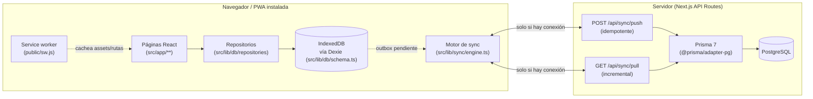

# ARCHITECTURE.md

Este documento describe **cómo está construido lo que ya existe** (Fases
1, 2, 3, 3.5, 4 y 5). Para la arquitectura objetivo completa del proyecto
(todas las fases, modelo de datos completo, riesgos) ver [`IMPLEMENTATION_PLAN.md`](./IMPLEMENTATION_PLAN.md).
Para el detalle específico de offline/sincronización, con diagramas, ver
[`OFFLINE_SYNC.md`](./OFFLINE_SYNC.md) — su §8 documenta el modelo de
lotes/siembras/traslados (Fase 2), su §9 el de alimento/mortalidad/
muestreos (Fase 3), su §10 el hardening de consistencia de la Fase 3.5
(comandos de negocio compuestos, orden de sync determinista, recuperación
de fallos parciales), su §11 calidad del agua, alertas y tareas (Fase 4),
y su §12 economía y cierre productivo (Fase 5). Para la política
contable (qué es una compra vs un gasto, costo de inventario de
alimento, economía de lote), ver [`ECONOMICS.md`](./ECONOMICS.md).

## 1. Visión general

Principio rector: **toda pantalla lee y escribe primero contra IndexedDB**.
La red solo entra en juego en segundo plano, a través del motor de
sincronización, y su ausencia nunca bloquea ni degrada la experiencia
(ver §5 y §6 de `IMPLEMENTATION_PLAN.md`).

## 2. Capas y responsabilidades

### `src/lib/domain/` — dominio puro (Fases 2, 3, 4 y 5)

Funciones puras, sin dependencias de Dexie ni de Prisma, importadas por
igual desde el cliente (repositorios) y el servidor
(`_lib/applyOperation.ts`) para que la regla de negocio sea exactamente
una, nunca dos implementaciones que puedan divergir:

- `batchLedger.ts`: cálculo de dónde está un lote (`getBatchPondBalance`,
  `getBatchDistribution`, `getBatchTotalBalance`, `getPondOccupancy`) a
  partir de siembras, traslados **y mortalidad** — nunca de un campo
  mutable. También `getSurvivalPercent`/`getMortalityPercent`. Ver
  `OFFLINE_SYNC.md` §8.1 y §9.5.
- `biomass.ts`: `calculateBiomassKg(cantidad, pesoPromedioG)`.
- `batchCode.ts`: código de lote único generable offline (especie + año +
  secuencia local + sufijo de dispositivo). Ver `OFFLINE_SYNC.md` §8.4.
- `pondGeometry.ts`: estado calculado-vs-manual de área/volumen de un
  estanque a partir de largo/ancho/profundidad, sin sobrescribir un valor
  manual sin avisar.
- `feedLedger.ts` (Fase 3): signo único de cada tipo de movimiento de
  inventario de alimento y stock derivado del ledger — nunca un
  `Feed.stockKg`. Ver `OFFLINE_SYNC.md` §9.1.
- `sampling.ts` (Fase 3): peso promedio de un muestreo y peso estimado
  por lote+estanque (último muestreo, o el peso de siembra si no hay
  ninguno), con agregado ponderado cuando el lote está repartido. Ver
  `OFFLINE_SYNC.md` §9.5.
- `growth.ts` / `fcr.ts` (Fase 3): crecimiento diario y FCR operacional
  entre dos muestreos, ambos con "datos insuficientes" explícito en vez
  de `Infinity`/`NaN`. Ver `OFFLINE_SYNC.md` §9.6.
- `ration.ts` (Fase 3): calculadora de ración diaria recomendada — nunca
  crea movimientos de inventario por sí sola.
- `format.ts` (Fase 3): redondeo y formato numérico centralizados (kg,
  g, %, conteo) en locale es.
- `productionSummary.ts` (Fase 3): combina lo anterior en un resumen de
  producción por lote (peces actuales, supervivencia/mortalidad %,
  biomasa calculada por estanque, nunca cantidad total × un único
  peso).
- `waterQuality.ts` (Fase 4): `evaluateWaterQuality` — alertas
  operativas por especie presente en el estanque, nunca un diagnóstico;
  `assertPhysicallyValidMeasurement` — rangos físicos absolutos,
  distintos de los rangos recomendados por especie;
  `getLatestMeasurement`/`compareMeasurementRecency` — única fuente
  para decidir cuál es "la última medición" (fecha, luego hora, luego
  `createdAt` como desempate — nunca un orden de array sin garantías);
  `isMeasurementStale`; `getParameterTrend`. Ver `OFFLINE_SYNC.md` §11.1-§11.2.
- `task.ts` (Fase 4): `classifyTask` (hoy/próximas/vencidas/
  completadas/canceladas), `comparePriority`, `needsSamplingReminder`
  (solo una sugerencia visual, nunca crea una `Task`). Ver
  `OFFLINE_SYNC.md` §11.3-§11.4.
- `money.ts` (Fase 5): `formatMoney`/`roundMoney` — único punto de
  formato/redondeo de dinero de toda la app, moneda configurable
  (nunca "Bs" hardcodeado). Ver `ECONOMICS.md` §2-§3.
- `feedCost.ts` (Fase 5): `calculateFeedMovementCosts`/
  `calculateFeedInventoryValuation` — costo de alimento por promedio
  ponderado histórico, derivado del mismo `FeedInventoryMovement` de
  `feedLedger.ts`, nunca del precio actual del catálogo. Ver
  `ECONOMICS.md` §4.
- `batchEconomics.ts` (Fase 5): `getBatchEconomics` — función central
  única de costo directo/costo por kg/ingresos/ganancia/margen de un
  lote; nunca reparte gastos generales no asignados. Ver
  `ECONOMICS.md` §5-§9.
- `batchLedger.ts` (Fase 5, extendido): `getBatchPondBalance`/
  `getBatchDistribution`/`getPondOccupancy`/`getBatchTotalBalance`
  ahora reciben también `harvests` como cuarta salida del ledger
  (`siembra ± traslado - mortalidad - cosecha`); nuevas
  `getBatchHarvestedFishTotal`/`getBatchHarvestedWeightKgTotal`. Ver
  `OFFLINE_SYNC.md` §12.2.

### `src/lib/db/` — datos locales

- `schema.ts`: define `AppDatabase extends Dexie` con las tablas
  `species`, `ponds`, `fishBatches`, `stockings`, `fishTransfers`,
  `feeds`, `feedInventoryMovements`, `feedingRecords`,
  `mortalityRecords`, `samplings`, `waterQualityRecords`, `tasks`,
  `farmSettings`, `suppliers`, `customers`, `purchases`,
  `purchaseLines`, `expenses`, `harvests`, `sales`, `saleLines`,
  `syncQueue`, `syncMeta`, versionadas explícitamente
  (`this.version(1).stores(...)` … `this.version(4).stores(...)`).
  Cualquier cambio de esquema agrega una nueva versión, nunca modifica
  la existente, para no perder datos de dispositivos que llevaban tiempo
  sin sincronizar — cada salto de versión se probó explícitamente contra
  una base con datos de la versión anterior ya presentes
  (`schemaUpgrade.test.ts`, incluido v3→v4 de esta fase).
- `types.ts`: tipos de dominio (`SpeciesRecord`, `PondRecord`,
  `FishBatchRecord`, `StockingRecord`, `FishTransferRecord`,
  `FeedRecord`, `FeedInventoryMovementRecord`, `FeedingRecordRecord`,
  `MortalityRecordRecord`, `SamplingRecord`, `WaterQualityRecordRecord`,
  `TaskRecord`, ...), independientes del cliente Prisma generado — el
  navegador nunca importa código orientado a Node. También define
  `EventAuditFields` (campos de auditoría reducidos de los eventos
  append-only), reexportado desde `repositories/base.ts` para no romper
  el resto del código. `TaskRecord` es la única entidad de esta fase
  que usa `AuditFields` completo (mutable, con `version`) en vez de
  `EventAuditFields`.
- `deviceId.ts` / `uuid.ts`: identificador de instalación persistente
  (`localStorage`) y generación de UUID v4 en el dispositivo para toda
  entidad nueva.
- `repositories/base.ts`: capa de acceso a datos común. `createRecord`,
  `updateRecord` y `softDeleteRecord` envuelven **en una sola transacción
  Dexie** la escritura del registro de dominio y la entrada
  correspondiente en `syncQueue` — nunca queda un cambio guardado sin su
  operación de sincronización encolada, ni viceversa. `createEventRecord`
  es la variante para entidades *append-only* (`Stocking`,
  `FishTransfer`): sin `version`, sin actualización posible.
- `repositories/speciesRepository.ts` / `pondRepository.ts`: API
  específica de cada entidad sobre esa base común. `pondRepository`
  integra `applyPondGeometryPatch` para el modo calculado/manual de
  área y volumen.
- `repositories/fishBatchRepository.ts`: `createFishBatchWithStocking`
  crea el lote **y** su siembra inicial en una única transacción Dexie —
  nunca queda un lote a medias si falla una parte (§8.1 del encargo de
  Fase 2).
- `repositories/fishTransferRepository.ts`: `createFishTransfer` valida
  el balance disponible contra `getBatchPondBalance` **antes** de
  escribir — ver `OFFLINE_SYNC.md` §8.2.
- `repositories/ledgerQueries.ts`: consultas de solo lectura sobre el
  ledger para la UI (`getBatchDistribution`, `getBatchHistory`,
  `getPondOccupancy`, `getPondHistory`, y desde la Fase 3
  `getBatchProductionSummary`: peso/biomasa/supervivencia estimados).
- `repositories/feedRepository.ts` (Fase 3, comando compuesto desde
  Fase 3.5): `createFeed` crea el alimento y, si se indica stock
  inicial, su `FeedInventoryMovement` `INITIAL_STOCK`, en una
  transacción Dexie local; el outbox encola un único comando de negocio
  `CreateFeedWithInitialStock` (en vez de dos operaciones
  independientes) para que el servidor nunca pueda aplicar el `Feed`
  sin su stock inicial. Sin stock inicial sigue siendo un `Feed` CREATE
  simple. Ver `OFFLINE_SYNC.md` §10.1-§10.2.
- `repositories/feedingRepository.ts` (Fase 3, comando compuesto desde
  Fase 3.5): `createFeedingWithConsumption` escribe `FeedingRecord` +
  `FeedInventoryMovement` `CONSUMPTION` vinculados
  (`sourceType: "FEEDING"`) en una transacción Dexie local, validando el
  stock disponible antes de escribir; el outbox encola un único comando
  de negocio `RegisterFeeding`. Ver `OFFLINE_SYNC.md` §10.1-§10.2.
- `repositories/mortalityRepository.ts` (Fase 3): `createMortality`
  valida el balance del estanque (mismo criterio que los traslados)
  antes de escribir.
- `repositories/samplingRepository.ts` (Fase 3): `createSampling`
  calcula `averageWeightG` automáticamente y valida que el lote tenga
  registro en el estanque seleccionado.
- `repositories/waterQualityRepository.ts` (Fase 4): `createWaterQualityRecord`
  exige al menos un parámetro medido y valida rangos físicos
  (`assertPhysicallyValidMeasurement`) antes de escribir; evento
  append-only, igual criterio que `Sampling`.
- `repositories/taskRepository.ts` (Fase 4): `createTask`/`updateTask`/
  `completeTask`/`cancelTask`/`reopenTask`/`deleteTask` sobre
  `createRecord`/`updateRecord`/`softDeleteRecord` — la única entidad
  mutable de esta fase, mismo mecanismo que `speciesRepository.ts`.
- `repositories/syncQueueRepository.ts`: lectura/escritura de la cola de
  sincronización y de `syncMeta` (cursor `lastSyncedAt`), usado solo por
  el motor de sync, nunca por la UI directamente.
- `repositories/settingsRepository.ts` (Fase 5): `getFarmSettings`
  crea el singleton `FarmSettings` con valores por defecto la primera
  vez que se pide (encolando su propio `CREATE`), `updateFarmSettings`
  lo edita — mismo mecanismo LWW que `taskRepository.ts`.
- `repositories/supplierRepository.ts` / `customerRepository.ts`
  (Fase 5): CRUD simple sobre `createRecord`/`updateRecord`, igual
  criterio que `speciesRepository.ts`.
- `repositories/purchaseRepository.ts` (Fase 5, comando compuesto):
  `registerPurchase` crea `Purchase` + `PurchaseLine[]` (+ un
  `FeedInventoryMovement` `PURCHASE` por cada línea de alimento) en una
  transacción Dexie local; el outbox encola un único comando de
  negocio `RegisterPurchase`. `updatePurchasePaymentStatus` es la única
  otra mutación permitida. Ver `OFFLINE_SYNC.md` §12.1.
- `repositories/harvestRepository.ts` (Fase 5): `createHarvest` valida
  el balance del lote+estanque (mismo criterio que
  `fishTransferRepository.ts`/`mortalityRepository.ts`) y calcula
  `averageWeightG` automáticamente.
- `repositories/saleRepository.ts` (Fase 5, comando compuesto):
  `registerSale` crea `Sale` + `SaleLine[]`, validando contra
  `getAvailableKgForHarvest` cuando una línea referencia una cosecha;
  el outbox encola un único comando de negocio `RegisterSale`.
  `updateSalePaymentStatus` es la única otra mutación permitida.
- `repositories/expenseRepository.ts` (Fase 5): `createExpense` evento
  append-only; `voidExpense` anula con `deletedAt` + `voidReason`
  obligatorio, nunca borra físicamente un gasto ya sincronizado.
- `repositories/batchEconomicsRepository.ts` (Fase 5): envoltorio de
  solo lectura que trae de Dexie todo lo que necesita
  `getBatchEconomics` (dominio) y resuelve el vínculo
  `FeedingRecord` → `FeedInventoryMovement` por `sourceType`/`sourceId`.

### `src/lib/sync/` — sincronización cliente

- `client.ts`: llamadas HTTP delgadas a `/api/sync/push` y
  `/api/sync/pull`. Sin lógica de reintentos.
- `status.ts`: store observable minimalista (`getSyncStatus`,
  `subscribeSyncStatus`, `setSyncStatus`) consumido con
  `useSyncExternalStore` desde React.
- `priority.ts` (Fase 3.5): `getSyncPriority`/`getDependencyEntityIds`/
  `selectReadyOperations` — orden de envío explícito por niveles de
  dependencia real (no solo `createdAt`) y filtro simple de un solo paso
  que retiene a los hijos de un padre actualmente en error. Ver
  `OFFLINE_SYNC.md` §10.5-§10.6.
- `conflictMessages.ts` (Fase 3.5): `getConflictMessage` — mensaje de
  conflicto específico por tipo de operación (balance/stock vs. versión
  LWW), para que un comando compuesto se presente como un único
  incidente comprensible. Ver `OFFLINE_SYNC.md` §10.8.
- `engine.ts`: orquesta un ciclo de sincronización (`runSync`) — ver
  `OFFLINE_SYNC.md` para el flujo completo — y expone `startSyncEngine()`
  para conectar los disparadores automáticos (apertura de la app, evento
  `online`, intervalo periódico). Usa `priority.ts` para decidir el orden
  y el filtro de dependencias del lote a enviar, y `conflictMessages.ts`
  al marcar una operación en conflicto como error local.

### `src/lib/validation/sync.ts` — validación compartida

Esquemas Zod para el protocolo de sincronización, usados tanto en el
cliente (antes de construir el payload) como en el servidor (`/api/sync/push`
nunca confía en que el cliente ya validó). Un mismo esquema, dos usos.

### `src/lib/server/prisma.ts` — cliente de base de datos

Singleton de `PrismaClient` con el driver adapter `@prisma/adapter-pg`
(requerido por Prisma 7 para PostgreSQL — ver la nota de arquitectura en
`IMPLEMENTATION_PLAN.md` §4.4.1). Solo se importa desde código de
servidor (API routes).

### `src/app/api/sync/` — API de sincronización

- `push/route.ts`: valida con Zod, aplica cada operación en una
  transacción Prisma, y usa `operationId` (único en `SyncOperation`) como
  clave de idempotencia — ver `OFFLINE_SYNC.md` §3. Desde la Fase 3.5,
  solo el estado `"applied"` es terminal: un `operationId` que quedó en
  `"conflict"`/`"error"` se vuelve a evaluar en el siguiente reintento
  (con el mismo `operationId`, actualizando la fila existente vía
  `upsert`) en vez de repetir para siempre el mismo status guardado —
  ver `OFFLINE_SYNC.md` §10.7 (el bug real que esto corrigió y cómo se
  probó).
- `pull/route.ts`: entrega cambios posteriores a `?since=`, calculando su
  propio cursor (`serverTime`) antes de leer, para que el cliente nunca
  dé por sincronizado un cambio que llegó a mitad de la consulta.
  Entrega `fishBatches`/`stockings`/`fishTransfers` (Fase 2),
  `feeds`/`feedInventoryMovements`/`feedingRecords`/`mortalityRecords`/
  `samplings` (Fase 3), y `waterQualityRecords`/`tasks` (Fase 4);
  las entidades append-only se filtran por `createdAt`, no `updatedAt`
  — nunca se actualizan (`waterQualityRecords` entre ellas; `tasks` sí
  usa `updatedAt`, es mutable). No cambió en la Fase 3.5: siempre
  entrega las entidades reales, nunca el comando de negocio compuesto
  que las creó.
- `_lib/applyOperation.ts`: aplica CREATE/UPDATE/DELETE con resolución de
  conflictos last-write-wins por número de versión para `Species`/`Pond`/
  `FishBatch`/`Feed`/`Task` (Fase 4: mismo mecanismo, ninguna lógica
  nueva). Para `FishTransfer` y `MortalityRecord` aplica además la
  validación de balance de peces con bloqueo de concurrencia
  (`pg_advisory_xact_lock` por `batchId`) descrita en `OFFLINE_SYNC.md`
  §8.3; para `FeedInventoryMovement` de tipo salida (`CONSUMPTION`,
  `ADJUSTMENT_OUT`, `LOSS`) aplica el mismo mecanismo con un lock por
  `feedId` (§9.4). Un movimiento/registro que dejaría un balance
  negativo vuelve `status: "conflict"` en vez de aplicarse. Desde la
  Fase 3.5, `applyRegisterFeedingOperation` y
  `applyCreateFeedWithInitialStockOperation` aplican los comandos de
  negocio compuestos: sus dos escrituras (`FeedingRecord`+
  `FeedInventoryMovement`, o `Feed`+`FeedInventoryMovement`) ocurren
  dentro de la misma transacción que ya envuelve `push/route.ts` — ver
  `OFFLINE_SYNC.md` §10.1-§10.2. Los handlers legacy
  (`applyFeedingRecordOperation`, `applyFeedInventoryMovementOperation`,
  `applyFeedOperation`) siguen existiendo, sin cambios, por compatibilidad
  con outbox pendiente de versiones anteriores de la app (§10.4).
  `applyWaterQualityRecordOperation` (Fase 4) es un `upsert` simple, sin
  ninguna validación de balance — `WaterQualityRecord` nunca la
  necesita (§1 del encargo de Fase 4).

### `src/app/` — UI

- `layout.tsx`: shell raíz (español, metadata, `SyncProvider` +
  `ServiceWorkerRegister` + `InstallPrompt` montados una vez).
- `page.tsx`: dashboard con conteos en vivo (`useLiveQuery` sobre Dexie):
  estanques/lotes activos, peces vivos y biomasa estimados (vía
  `getBatchProductionSummary`), mortalidad hoy/acumulada, alimento hoy/
  este mes, stock total de alimento y alimentos bajo mínimo, y (Fase 4)
  alertas de agua (`evaluateWaterQuality` sobre la última medición de
  cada estanque), estanques sin medición reciente, tareas hoy/vencidas/
  próximas. Deliberadamente sin analítica compleja todavía (§35 del
  encargo de Fase 3).
- `especies/page.tsx`: alta/edición completas (incluidos los campos
  productivos opcionales — peso objetivo, ciclo, temperatura/pH/
  oxígeno, FCR y mortalidad esperados) + lista en vivo, pensado para
  completarse en segundos desde un teléfono (§75 del encargo de Fase 1).
- `estanques/page.tsx` + `estanques/nuevo/page.tsx` + `estanques/[id]/page.tsx`:
  listado con superficie/volumen/lotes (derivado de `getPondOccupancy`,
  nunca guardado); alta con geometría calculada-vs-manual
  (`PondGeometryFields`); ficha con pestañas Resumen/Producción/
  Alimentación/Mortalidad/Muestreos/Calidad del agua/Historial, peces y
  biomasa estimados del estanque, y accesos directos a los cuatro
  registros rápidos (incluida calidad del agua desde la Fase 4) con el
  estanque preseleccionado. La pestaña de calidad del agua muestra la
  última medición, sus alertas (si las hay) y el historial reciente.
- `lotes/page.tsx` + `lotes/nuevo/page.tsx` + `lotes/[id]/page.tsx`:
  listado con ubicación derivada (`getBatchDistribution`); alta
  transaccional de lote + siembra inicial con preview de biomasa; ficha
  con distribución actual, "Traslado rápido" (preview Disponibles/
  Trasladar/Quedarán, `OFFLINE_SYNC.md` §8.2), supervivencia/
  mortalidad %, peso y biomasa estimados, alimento acumulado,
  crecimiento diario y FCR estimado (§9.5-§9.6), e historial combinado
  de los 5 tipos de evento.
- `alimentos/page.tsx` (Fase 3): catálogo de alimentos con stock
  inicial opcional al crear.
- `alimentacion/page.tsx` + `alimentacion/nueva/page.tsx` (Fase 3):
  resumen de hoy por estanque/alimento e historial; registro rápido que
  solo muestra los lotes presentes en el estanque elegido y el stock
  disponible del alimento antes de guardar.
- `mortalidad/page.tsx` + `mortalidad/nueva/page.tsx` (Fase 3): hoy/
  semana/acumulada por estanque e historial; registro rápido con
  preview de cuántos quedarán.
- `muestreos/nuevo/page.tsx` (Fase 3): registro rápido con preview del
  peso promedio calculado.
- `calidad-agua/page.tsx` + `calidad-agua/nueva/page.tsx` (Fase 4):
  últimas mediciones por estanque, alertas activas, estanques sin
  medición reciente, historial reciente; registro con estanque + fecha
  obligatorios y los ocho parámetros opcionales, unidades visibles en
  cada campo.
- `tareas/page.tsx` + `tareas/nueva/page.tsx` (Fase 4): secciones
  Vencidas/Hoy/Próximas/Completadas (colapsables, `classifyTask`),
  check grande para completar/reabrir sin salir de la lista; alta con
  título, fecha/hora, prioridad, estanque/lote opcionales.
- `calendario/page.tsx` (Fase 4): vista Agenda (hoy + próximos 14 días
  con eventos) y vista Mes (grid simple, sin librería de calendario),
  combinando tareas pendientes con eventos históricos (muestreos,
  mediciones de agua) y la cosecha estimada de cada lote
  (`FishBatch.expectedHarvestDate`) — siempre etiquetados como "Tarea
  pendiente" o "Evento histórico", nunca mezclados sin distinción.
- `manifest.ts`, `icons/[size]/route.tsx`: metadatos de PWA (ver
  `IMPLEMENTATION_PLAN.md` §7).

### `src/components/`

- `layout/AppShell.tsx`: header con el badge de sincronización +
  navegación inferior mobile-first (Inicio, Especies, Lotes, Estanques,
  Alimentación, Mortalidad, Agua, Tareas).
- `layout/QuickRegisterButton.tsx` (Fase 3, ampliado en Fase 4): botón
  "+ Registrar" flotante presente en cualquier pantalla (§38 del
  encargo de Fase 3), con acceso directo a los cuatro registros rápidos
  (Alimentación/Mortalidad/Muestreo/Calidad del agua) sin depender de
  estar dentro de una ficha concreta, más "Nueva tarea" separado por un
  divisor visual (§28 del encargo de Fase 4: una tarea no es un
  registro de producción).
- `sync/SyncStatusBadge.tsx`: indicador 🟢/🟠/🔴/⚫ + botón "Sincronizar ahora".
- `sync/SyncProvider.tsx`: arranca el motor de sync una vez para toda la app.
- `pwa/ServiceWorkerRegister.tsx`, `pwa/InstallPrompt.tsx`: registro del service worker y aviso discreto de instalación.
- `ponds/PondGeometryFields.tsx`: campos de largo/ancho/profundidad →
  área/volumen calculados o manuales, con "Recalcular" explícito —
  nunca sobrescribe un valor manual en silencio.

## 3. Modelo de datos actual

`prisma/schema.prisma` (Fases 1, 2, 3 y 4):

- **`Species`** — catálogo de especies productivo: nombre, peso objetivo,
  ciclo estimado, rangos de temperatura/pH/oxígeno, FCR y mortalidad
  esperados.
- **`Pond`** — estanques: código, nombre, geometría (largo/ancho/
  profundidad → área/volumen, cada uno `CALCULATED` o `MANUAL`), estado
  (`PondStatus`), activo/inactivo (soft-delete).
- **`FishBatch`** — lote productivo: especie, siembra inicial (fecha,
  cantidad, peso promedio, biomasa), costo de alevines, estado
  (`BatchStatus`). **Nunca** guarda un estanque ni una cantidad "actual"
  — ver `OFFLINE_SYNC.md` §8.1.
- **`Stocking`** — evento de siembra (append-only): lote, estanque,
  fecha, cantidad, peso/biomasa. Es la única forma de que un lote entre
  a un estanque por primera vez.
- **`FishTransfer`** — evento de traslado (append-only): lote, estanque
  de origen y de destino, fecha, cantidad. Soporta traslados parciales
  (un lote puede repartirse entre varios estanques) y queda validado
  contra el balance disponible — ver `OFFLINE_SYNC.md` §8.2-§8.3.
- **`Feed`** — catálogo de alimentos: nombre, marca, % proteína, tamaño
  de pellet, costo por defecto, stock mínimo. Mutable, igual criterio
  que `Species`/`Pond`.
- **`FeedInventoryMovement`** — evento de movimiento de inventario de
  alimento (append-only): tipo, `quantityKg` siempre positivo (el signo
  lo decide el tipo, ver `OFFLINE_SYNC.md` §9.1), `sourceType`/
  `sourceId` opcionales para vincular un consumo a su `FeedingRecord`
  de origen (`@@unique([sourceType, sourceId])`, §9.2).
- **`FeedingRecord`** — registro de alimentación (append-only): lote,
  estanque, alimento, cantidad, turno/hora opcionales.
- **`MortalityRecord`** — mortalidad (append-only): lote, estanque,
  cantidad, causa. Integrada en el ledger de peces como una salida más
  (§9.5).
- **`Sampling`** — muestreo (append-only): lote, estanque, peces/peso
  muestreados, `averageWeightG` ya calculado.
- **`WaterQualityRecord`** (Fase 4) — medición de calidad del agua
  (append-only): estanque, lote opcional, fecha/hora, ocho parámetros
  todos opcionales (temperatura, pH, oxígeno disuelto, transparencia,
  amonio, nitrito, alcalinidad, nivel de agua) — requisito mínimo
  (estanque + fecha + al menos un parámetro) validado en la capa de
  aplicación, no en el esquema. **Nunca** un `pond.currentPh` mutable
  — ver `OFFLINE_SYNC.md` §11.1.
- **`Task`** (Fase 4) — tarea manual: título, fecha/hora, prioridad,
  estado (`TaskStatus`), estanque/lote opcionales, responsable. La
  **única** entidad mutable introducida después de la Fase 1 en este
  dominio — ver `OFFLINE_SYNC.md` §11.3.
- **`SyncOperation`** — registro de operaciones de sync procesadas por el
  servidor; `operationId` es la clave de idempotencia.

`Species`, `Pond`, `FishBatch`, `Feed` y `Task` comparten los mismos
campos de auditoría (`createdAt`, `updatedAt`, `deletedAt`, `version`,
`deviceId`, `createdBy`, `updatedBy`) tanto en Prisma como en Dexie, con
los mismos nombres — el mapeo entre ambos lados es directo, y `version`
es la base de la resolución de conflictos last-write-wins (§6 de
`OFFLINE_SYNC.md`). `Stocking`, `FishTransfer`, `FeedInventoryMovement`,
`FeedingRecord`, `MortalityRecord`, `Sampling` y `WaterQualityRecord`,
al ser append-only, no tienen `version` ni `updatedAt`: nunca se
editan, así que no hay nada que resolver por ese mecanismo — su único
conflicto posible sería el de balance (§8.3, §9.4), y
`WaterQualityRecord` ni siquiera ese: no valida ningún balance.

- **`FarmSettings`** (Fase 5) — singleton (`id = "default"`) mutable
  LWW: `currencyCode`/`currencySymbol`, para no hardcodear "Bs" en
  ninguna función (ver `ECONOMICS.md` §2).
- **`Supplier`**/**`Customer`** (Fase 5) — catálogos mutables LWW,
  mismo criterio que Species/Pond/Feed.
- **`Purchase`** + **`PurchaseLine`** (Fase 5) — cabecera + líneas de
  una compra. `Purchase` es mutable LWW pero la UI solo la reedita para
  su estado de pago; `PurchaseLine` es append-only. Se crean siempre
  juntas (y, si hay línea de alimento, junto con su
  `FeedInventoryMovement` PURCHASE) mediante el comando compuesto
  `RegisterPurchase` — ver `OFFLINE_SYNC.md` §12.1.
- **`Expense`** (Fase 5) — gasto append-only, con anulación auditada
  (`deletedAt` + `voidReason`), nunca duplica una compra ya registrada
  vía `Purchase` (ver `ECONOMICS.md` §1).
- **`Harvest`** (Fase 5) — cosecha append-only, integrada en el ledger
  de peces como una salida más (`getBatchPondBalance`), mismo criterio
  de lock por `batchId` que `FishTransfer`/`MortalityRecord` — ver
  `OFFLINE_SYNC.md` §12.2.
- **`Sale`** + **`SaleLine`** (Fase 5) — cabecera + líneas de una
  venta, mismo criterio de atomicidad/mutabilidad que
  `Purchase`/`PurchaseLine`. `SaleLine.harvestId` opcional vincula la
  venta a una cosecha concreta, validado contra el kg disponible de
  esa cosecha mediante advisory lock — ver `OFFLINE_SYNC.md` §12.1.
- **`SyncOperation`** — registro de operaciones de sync procesadas por el
  servidor; `operationId` es la clave de idempotencia.

`Species`, `Pond`, `FishBatch`, `Feed`, `Task`, `FarmSettings`,
`Supplier`, `Customer`, `Purchase` y `Sale` comparten los mismos
campos de auditoría (`createdAt`, `updatedAt`, `deletedAt`, `version`,
`deviceId`, `createdBy`, `updatedBy`) tanto en Prisma como en Dexie, con
los mismos nombres — el mapeo entre ambos lados es directo, y `version`
es la base de la resolución de conflictos last-write-wins (§6 de
`OFFLINE_SYNC.md`). `Stocking`, `FishTransfer`, `FeedInventoryMovement`,
`FeedingRecord`, `MortalityRecord`, `Sampling`, `WaterQualityRecord`,
`PurchaseLine`, `Expense`, `Harvest` y `SaleLine`, al ser append-only,
no tienen `version` ni `updatedAt`: nunca se editan, así que no hay
nada que resolver por ese mecanismo — su único conflicto posible sería
el de balance (§8.3, §9.4, §12.2), y `WaterQualityRecord`/`Expense`/
`PurchaseLine` ni siquiera ese: no validan ningún balance.

El modelo de datos completo del dominio piscícola queda cubierto con
la Fase 5 — ver `IMPLEMENTATION_PLAN.md` §4 y `ECONOMICS.md` para la
política contable.

## 4. Decisiones de arquitectura tomadas durante la Fase 1

Estas decisiones surgieron al implementar (no estaban en el plan
original) y quedan documentadas aquí y en `IMPLEMENTATION_PLAN.md` para
que no se repitan las mismas dudas en fases futuras:

1. **Prisma 7 requiere un driver adapter explícito** (`@prisma/adapter-pg`)
   y mueve la URL de conexión de `schema.prisma` a `prisma.config.ts`. Ver
   `IMPLEMENTATION_PLAN.md` §4.4.1.
2. **Sin `@serwist/next`**: inyecta un hook de webpack en `next.config`,
   incompatible con Turbopack (por defecto en Next 16 tanto en `dev` como
   en `build`). Se implementó un service worker propio, documentado línea
   por línea en `public/sw.js`. Ver `IMPLEMENTATION_PLAN.md` §7.
3. **TypeScript 5.9.3, no 7.0.2**: `typescript-eslint` no soporta TS 7.0
   todavía (falla al cargar, no es una precaución). Ver `IMPLEMENTATION_PLAN.md` §3.3.
4. **ESLint 9.39.5, no 10.10.0**: las dependencias anidadas reales de
   `eslint-config-next` (`eslint-plugin-react`, `eslint-plugin-jsx-a11y`,
   `eslint-plugin-import`) todavía no soportan ESLint 10 en la práctica.
   Ver `IMPLEMENTATION_PLAN.md` §3.3.
5. **`navigator.onLine` no es suficiente**: puede seguir reportando
   `true` justo después de un corte de red real. El motor de sync también
   infiere "sin conexión" de que `fetch()` lance `TypeError` (la señal
   real de fallo de red, a diferencia de una respuesta HTTP de error).
6. **El comportamiento offline se verifica contra un build de
   producción**, nunca contra `next dev` — ver la nota en `README.md` y
   en `IMPLEMENTATION_PLAN.md` §11.

## 4.1 Decisiones de arquitectura tomadas durante la Fase 2

1. **El balance de peces por estanque nunca se guarda, siempre se
   calcula** a partir de `Stocking`+`FishTransfer` (ver
   `OFFLINE_SYNC.md` §8.1). Es la única forma de soportar traslados
   parciales sin una fuente de verdad duplicada que pudiera
   desincronizarse del historial real.
2. **El código de lote se genera 100% offline** (especie + año +
   secuencia local + sufijo de dispositivo) en vez de pedir un
   consecutivo al servidor — un consecutivo perfecto habría requerido
   coordinación online, incompatible con crear lotes sin red. Ver
   `OFFLINE_SYNC.md` §8.4.
3. **La validación de balance se hace dos veces, cliente y servidor, y
   nunca se confía solo en la del cliente**: un dispositivo offline
   puede tener una vista desactualizada del ledger. El servidor
   serializa con un advisory lock de Postgres por lote
   (`pg_advisory_xact_lock`) para que dos traslados concurrentes del
   mismo lote nunca puedan ambos leer el mismo balance "antes" del otro
   — ver `OFFLINE_SYNC.md` §8.3.
4. **Un traslado en conflicto se marca `"conflict"`, nunca se aplica
   parcialmente ni se inventa una cantidad**: la fila de `FishTransfer`
   simplemente no se inserta, y la operación queda visible como error en
   el dispositivo que la generó para revisión manual.
5. **`FishBatch` + `Stocking`** se crean en una única transacción Dexie
   (`createFishBatchWithStocking`), no con el helper genérico de una
   sola entidad — un lote nunca puede quedar creado sin su siembra
   inicial si algo falla a mitad de camino.

## 4.2 Decisiones de arquitectura tomadas durante la Fase 3

1. **El inventario de alimento sigue el mismo principio de ledger que
   los peces**: `Feed` nunca tiene un `stockKg` mutable; se deriva
   siempre de `FeedInventoryMovement`. El signo de cada movimiento
   (entrada/salida) lo decide una única función
   (`getFeedMovementSignedQuantity`), nunca cada pantalla por su
   cuenta. Ver `OFFLINE_SYNC.md` §9.1.
2. **La mortalidad se integra al ledger de peces como una salida más**,
   con el mismo tratamiento que un traslado saliente — no se creó un
   cálculo de balance paralelo. `getBatchPondBalance` pasó a recibir
   `mortalities` como tercer parámetro explícito en vez de un default
   opcional, para que cada punto de llamada declare a propósito qué
   eventos está considerando.
3. **El peso estimado nunca es un único valor global del lote**: se
   calcula por combinación `batchId`+`pondId` (último muestreo de esa
   combinación exacta, o el peso de siembra si no hay ninguno) y la
   biomasa total se arma sumando el componente de cada estanque —
   nunca `peces totales × un peso`. Ver `OFFLINE_SYNC.md` §9.5.
4. **FCR y crecimiento se marcan siempre como estimados**: el cálculo
   usa la cantidad *actual* del lote para aislar el efecto del cambio
   de peso entre dos muestreos, una simplificación documentada que no
   reconstruye el historial exacto de biomasa en cada fecha pasada. Se
   prefirió esta aproximación simple y honesta, con la etiqueta
   "estimado" siempre visible, a no ofrecer el dato o a presentarlo con
   una falsa precisión. Ver `OFFLINE_SYNC.md` §9.6.
5. **El plan de ración diaria es solo una calculadora**: nunca crea un
   `FeedInventoryMovement` por sí sola. Solo un `FeedingRecord`
   registrado a mano descuenta stock — "planificado" y "real" son
   conceptos deliberadamente separados (§32 del encargo de Fase 3).
6. **`EventAuditFields` se movió de `repositories/base.ts` a
   `db/types.ts`**: al escribir `types.ts` los nuevos `*Record`
   extendiendo esa interfaz directamente (en vez de inlinear sus tres
   campos como se hizo en Fase 2), habría quedado un import circular
   (`types.ts` → `base.ts` → `types.ts`). Se resolvió moviendo la
   definición al módulo de tipos, que es conceptualmente donde
   pertenece, y reexportándola desde `base.ts` para no romper el resto
   del código que ya la importaba de ahí.

## 4.3 Decisiones de arquitectura tomadas durante la Fase 3.5

Fase de hardening puro (§ el encargo la limitó explícitamente a
consistencia — "no añadas nuevas funcionalidades de negocio todavía"):
sin páginas ni entidades de dominio nuevas. Ver `OFFLINE_SYNC.md` §10
para el detalle completo de cada punto.

1. **"Registrar alimentación" y "crear alimento con stock inicial" se
   sincronizan como un único comando de negocio**
   (`RegisterFeeding`/`CreateFeedWithInitialStock`), no como dos
   operaciones independientes: el riesgo de que el servidor aplicara
   una escritura sin la otra (una caída, un corte de red a mitad del
   segundo `push`) era real, no solo teórico. Cada comando se aplica en
   una única transacción de servidor — Postgres revierte todo si
   cualquier paso falla. No fue necesaria ninguna migración de Prisma
   (son comandos de protocolo, no tablas nuevas) ni de Dexie (las
   tablas locales no cambiaron).
2. **`FishTransfer` y `MortalityRecord` ya tenían esta misma garantía
   de atomicidad por construcción** desde las Fases 2/3: cada handler
   de `applyOperation` siempre recibió el mismo `tx` que registra el
   `SyncOperation`. El riesgo específico de la Fase 3.5 era el patrón
   de dos operaciones separadas para una sola acción de usuario, no una
   falla de atomicidad dentro de cada operación individual — se
   confirmó con pruebas que fuerzan un fallo real de Postgres a mitad
   de la transacción (no un mock), no solo con la revisión del código.
3. **Compatibilidad hacia atrás por convivencia, no por migración**: los
   `entityType` legacy (`FeedingRecord`/`FeedInventoryMovement`/`Feed`
   como operaciones separadas) siguen siendo válidos en el servidor —
   sus handlers no se tocaron. El outbox pendiente de un dispositivo con
   una versión anterior de la app sincroniza igual la próxima vez que se
   conecte. No se escribió ninguna transformación de datos existentes ni
   se tocó IndexedDB de ninguna forma destructiva.
4. **El orden de envío del outbox pasó de "por `createdAt`" a "por nivel
   de dependencia explícito, con `createdAt` solo como desempate"**
   (`src/lib/sync/priority.ts`): un dispositivo que trabajó offline
   mucho tiempo, creando entidades con timestamps que no reflejan
   necesariamente sus dependencias reales, ya no depende de esa
   coincidencia para que su primer sync se aplique sin errores de llave
   foránea evitables. Deliberadamente simple (no transitivo, sin
   estado): un filtro de una sola pasada que retiene a los hijos de un
   padre en error, sin construir un scheduler.
5. **Se corrigió un bug real de recuperación de fallos parciales**:
   `push/route.ts` trataba *cualquier* `SyncOperation` existente para un
   `operationId` (no solo `"applied"`) como definitiva, así que un
   `"conflict"`/`"error"` quedaba bloqueado para siempre — el motor de
   sync seguía reintentando, pero el servidor nunca volvía a evaluar la
   condición real (stock repuesto, padre ya sincronizado). Corregido
   para que solo `"applied"` sea terminal; se descubrió escribiendo las
   pruebas de orden de sincronización, no en el diseño original — un
   recordatorio de por qué las pruebas de estos escenarios eran parte
   explícita del encargo, no un accesorio.
6. **Mensajes de conflicto específicos por tipo de operación**
   (`src/lib/sync/conflictMessages.ts`): un conflicto de balance/stock
   (`RegisterFeeding`, `FishTransfer`, `MortalityRecord`,
   `FeedInventoryMovement`) usa el mensaje genérico de "versión más
   reciente" (pensado para `Species`/`Pond`/`FishBatch`/`Feed`) solo si
   no hay un tipo más específico — así un comando compuesto en
   conflicto se ve como un único incidente comprensible, nunca desglosado
   en sus escrituras internas.

## 4.4 Decisiones de arquitectura tomadas durante la Fase 4

1. **`WaterQualityRecord` sigue el mismo patrón de ledger que todo el
   resto del dominio**: sin campo mutable, historial completo, última
   medición siempre derivada. La única pieza nueva de diseño fue
   decidir CÓMO derivar "la última" cuando dos mediciones comparten
   fecha (`getLatestMeasurement`/`compareMeasurementRecency`,
   `OFFLINE_SYNC.md` §11.1) — encontrado escribiendo el E2E de esta
   fase, no en el diseño original.
2. **Las alertas de calidad del agua reutilizan los rangos que
   `Species` ya tenía desde la Fase 1/2** (`minTemperatureC`/
   `maxTemperatureC`/`minPh`/`maxPh`/`minDissolvedOxygenMgL`) — no se
   creó ninguna tabla nueva de "rangos recomendados". Evaluar contra
   TODAS las especies presentes en un estanque (no una sola) fue una
   decisión deliberada (§5 del encargo): un estanque mixto puede tener
   parámetros aceptables para una especie e insuficientes para otra.
3. **`Task` es la primera entidad mutable nueva desde la Fase 1** — se
   reutilizó el mecanismo de `createRecord`/`updateRecord` y
   last-write-wins tal cual, sin ningún ajuste: la arquitectura de
   conflictos ya estaba diseñada para esto desde el principio, no hubo
   que extenderla.
4. **El calendario no introdujo ninguna tabla nueva**: es una vista que
   combina `Task` con eventos ya existentes en otras tablas
   (`FishBatch.expectedHarvestDate`, `Sampling`, `WaterQualityRecord`)
   — evitar una tabla de "eventos de calendario" separada, que hubiera
   duplicado datos que ya viven en su tabla de origen.
5. **Ninguna alerta se persiste**: se evalúan siempre en el momento, a
   partir del historial ya sincronizado en IndexedDB — evita el riesgo
   de una alerta guardada quedando obsoleta si cambia el rango de la
   especie o se corrige una medición.
6. **Validación física (servidor) espejo de la del cliente**: los
   mismos límites (`pH` 0-14, temperatura -5 a 45 °C, el resto
   no-negativos) se repiten como bounds de Zod en
   `validation/sync.ts` — nunca se confía solo en que el cliente ya
   validó (§42 del encargo).

## 4.5 Decisiones de arquitectura tomadas durante la Fase 5

1. **Compra vs Gasto es una decisión de modelado explícita, no
   implícita**: se documentó primero como política contable
   (`ECONOMICS.md` §1) y solo después se tradujo a dos tablas
   separadas — evita que un futuro reporte sume ambas cuando en
   realidad representan el mismo concepto económico.
2. **El costo de alimento se deriva del ledger, nunca se guarda como
   snapshot por movimiento**: se consideró añadir `unitCostPerKg` real
   a los `FeedInventoryMovement` de tipo `CONSUMPTION` (hoy siempre
   `null`, heredado de la Fase 3.5), pero eso habría requerido tocar el
   protocolo de sync de `RegisterFeeding` ya en producción — se optó
   por una función de dominio pura (`feedCost.ts`) que recalcula el
   costo desde el historial ya existente, sin cambiar ni un campo de
   una fase anterior. Documentado como decisión (no como limitación) en
   `ECONOMICS.md` §4.
3. **`Harvest` reutiliza el lock por `batchId` de `FishTransfer`/
   `MortalityRecord` en vez de uno propio**: las tres compiten por el
   mismo balance de peces en un estanque, así que comparten el mismo
   mecanismo de `pg_advisory_xact_lock` — no se creó un lock nuevo.
4. **La supervivencia nunca se recalcula con el total reducido por
   cosecha**: encontrado al escribir `productionSummary.ts` — una
   cosecha es una decisión de negocio, no una pérdida, así que
   `getSurvivalPercent` sigue usando `stockedTotal - mortalityTotal`
   explícitamente (ver `OFFLINE_SYNC.md` §12.2).
5. **`Purchase`/`Sale` reutilizan LWW en vez de un mecanismo nuevo de
   "inmutable tras confirmar"**: en vez de inventar un tercer patrón de
   auditoría, se restringió por convención de UI (nunca se expone un
   formulario de edición completa) sobre el mismo mecanismo de versión
   que ya existía — la única mutación real que se ejerce es el estado
   de pago.
6. **Dos niveles de prioridad de sync nuevos, no uno**: `RegisterSale`
   necesitaba depender de que un `Harvest` referenciado ya estuviera
   aplicado (para validar su balance de kg correctamente), lo que no
   encajaba en los 4 niveles existentes — se añadió el nivel 5 en vez
   de forzarlo dentro del nivel 4 (ver `OFFLINE_SYNC.md` §12.3).

## 5. Qué NO está implementado todavía

Con la Fase 5 se cubre el resto del dominio productivo y económico
básico. Deliberadamente fuera de alcance (§76 del encargo de Fase 5,
ver `IMPLEMENTATION_PLAN.md` §9): contabilidad fiscal, facturación
electrónica, impuestos, integración bancaria, nómina, tratamientos/
medicamentos, diagnóstico de enfermedades, reproducción, sensores IoT,
IA, múltiples fincas, un ERP completo, reportes PDF avanzados,
autenticación, roles de usuario, gráficos avanzados, notificaciones
push, eventos automáticos de producción creados desde el calendario, y
el aviso interactivo "nueva versión disponible" del service worker
(por ahora se actualiza solo, sin avisar). Ver también `ECONOMICS.md`
§12 para las limitaciones específicas de la política contable
(correcciones/anulaciones, `fryCost` vs compra explícita de alevines).
