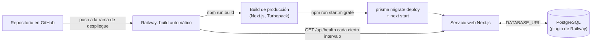

# DEPLOYMENT.md

Despliegue en producción sobre Railway: GitHub → Railway → Next.js →
PostgreSQL. Complementa `SECURITY.md` (variables sensibles) y
`BACKUP_RESTORE.md` (estrategia de respaldo del PostgreSQL de producción).

## 1. Arquitectura de despliegue



Un único servicio web (Next.js, corriendo `next start` sobre el build de
producción) más un plugin de PostgreSQL — **sin ninguna dependencia
externa adicional** (sin Redis, sin colas, sin un servicio de
autenticación de terceros): el rate limiting de login es en memoria del
propio proceso (ver `SECURITY.md` §5) y el service worker/PWA no requiere
ningún servicio de push notifications.

## 2. Preparar el proyecto en Railway

1. Crear un proyecto nuevo en Railway.
2. Añadir un plugin de **PostgreSQL** al proyecto — Railway provisiona la
   base y expone `DATABASE_URL` automáticamente a cualquier servicio del
   mismo proyecto que la referencie.
3. Añadir este repositorio de GitHub como servicio — Railway detecta
   Next.js automáticamente vía Nixpacks (`railway.json` ya fija
   `"builder": "NIXPACKS"` explícitamente, para no depender de la
   autodetección silenciosa).
4. Conectar el servicio web al plugin de PostgreSQL del mismo proyecto
   (Railway ofrece esto como una referencia de variable, `${{Postgres.DATABASE_URL}}`
   o equivalente según la UI vigente) — así `DATABASE_URL` llega al
   servicio sin copiarla a mano.

## 3. `railway.json`: build, start y healthcheck

El repositorio ya incluye `railway.json` en la raíz:

```json
{
  "build": { "builder": "NIXPACKS", "buildCommand": "npm run build" },
  "deploy": {
    "startCommand": "npm run start:migrate",
    "healthcheckPath": "/api/health",
    "healthcheckTimeout": 120,
    "restartPolicyType": "ON_FAILURE",
    "restartPolicyMaxRetries": 5
  }
}
```

- **Build**: `npm run build` (`next build`, Turbopack) — sin pasos
  manuales adicionales; `postinstall: "prisma generate"` (`package.json`)
  ya asegura que el cliente de Prisma esté generado antes del build,
  automáticamente en cada `npm install` que Railway ejecuta.
- **Start**: `npm run start:migrate`, que es
  `prisma migrate deploy && next start` (`package.json`) — las
  migraciones pendientes se aplican **automáticamente en cada despliegue,
  antes de que el servicio empiece a aceptar tráfico**. Nunca hace falta
  un paso manual de "conectarse y correr las migraciones" (ver §5 sobre
  por qué esto es seguro).
- **Healthcheck**: `GET /api/health` (`src/app/api/health/route.ts`) —
  público, sin autenticación (necesario para que Railway pueda
  consultarlo), hace `SELECT 1` contra Postgres vía Prisma y responde
  `{status: "ok", time}` (200) o `{status: "error", time}` (503). Railway
  espera hasta 120 segundos (`healthcheckTimeout`) a que responda antes de
  considerar el despliegue fallido, y reintenta hasta 5 veces
  (`restartPolicyMaxRetries`) si el proceso se cae.

## 4. Variables de entorno en Railway

Configurar en el panel del servicio (Settings → Variables):

| Variable | Origen | Notas |
|---|---|---|
| `DATABASE_URL` | Automática (referencia al plugin de PostgreSQL) | Nunca se copia a mano |
| `NODE_ENV` | `"production"` | Railway lo fija automáticamente en despliegues; verificar que quede así — condiciona las cabeceras de seguridad de `next.config.ts` (ver `SECURITY.md` §6) |
| `AUTH_SECRET` | **Manual, obligatoria** | Generar con `openssl rand -base64 48`; nunca commitear. Ver `SECURITY.md` §4 |
| `SEED_DEMO_DATA` | `"false"` (o no definida) | Nunca `"true"` en producción — evita sembrar datos de demostración por accidente |
| `APP_PUBLIC_URL` | **Manual, obligatoria para recuperación por email** | URL pública real del servicio (ej. `https://tu-app.up.railway.app`) — sin esto, el enlace del email de recuperación queda mal formado |
| `EMAIL_WEBHOOK_URL` / `EMAIL_WEBHOOK_API_KEY` / `EMAIL_FROM` | **Manual, obligatorias para recuperación por email** | Ver `SECURITY.md` §11.1 — sin `EMAIL_WEBHOOK_URL`, el enlace de recuperación solo se registra en el log, nadie lo recibe de verdad. El reset por ADMIN desde `/usuarios` sigue funcionando igual sin esto configurado |

`ADMIN_USERNAME`/`ADMIN_NAME`/`ADMIN_PASSWORD` **no** se dejan como
variables permanentes del servicio — son solo para el bootstrap puntual
del §6, ejecutado una vez y retiradas después.

## 5. Migraciones de Prisma: automáticas y seguras

- `npm run start:migrate` corre `prisma migrate deploy` **en cada arranque
  del contenedor**, antes de `next start` — así un despliegue nunca sirve
  tráfico contra un esquema desactualizado, y un redeploy sin cambios de
  esquema simplemente no aplica nada (`migrate deploy` es idempotente: solo
  aplica migraciones que todavía no están en la tabla `_prisma_migrations`
  de esa base).
- **Ninguna migración de esta fase es destructiva.** La migración
  `add_authentication` (`prisma/migrations/20260910063748_add_authentication/`)
  es puramente aditiva: crea el enum `UserRole`, la tabla `users`, sus
  índices, y añade índices (`@@index([updatedAt])`/`@@index([createdAt])`)
  a las tablas ya existentes — ningún `DROP`, ningún `ALTER COLUMN` que
  pueda perder datos. Es seguro que corra sola, sin supervisión manual, en
  cada despliegue.
- **Regla para futuras migraciones**: cualquier cambio de esquema que
  renombre o elimine una columna/tabla ya usada en producción debe
  dividirse en pasos aditivos primero (columna nueva, backfill, y solo
  después el cambio destructivo en un despliegue posterior) — el pipeline
  de `migrate deploy` automático asume que toda migración es segura de
  aplicar sin intervención humana; una migración destructiva sin ese
  cuidado podría perder datos de producción sin que nadie lo revise a
  tiempo.
- Verificar el estado de las migraciones en cualquier momento:
  `DATABASE_URL="<la de producción>" npx prisma migrate status`.

## 6. Bootstrap del primer administrador

`npm run db:seed` **nunca** crea un usuario administrador — no hay
credenciales de ningún tipo sembradas automáticamente (ver
`SECURITY.md` §4). El primer `ADMIN` se crea con un paso manual explícito,
una única vez tras el primer despliegue exitoso:

```bash
# Conectado a la base de producción (vía Railway CLI, un shell del
# servicio, o DATABASE_URL exportada localmente apuntando a producción):
ADMIN_USERNAME="admin" \
ADMIN_NAME="Nombre Apellido" \
ADMIN_PASSWORD="una-clave-fuerte-de-un-solo-uso" \
npm run auth:create-admin
```

`scripts/createAdmin.ts` hace `upsert` por `username`: si el usuario ya
existe, actualiza su contraseña, lo reactiva y revoca sus sesiones
anteriores (`tokenVersion` incrementado) — sirve tanto para el bootstrap
inicial como para recuperar acceso si se perdió la contraseña del único
admin. Cambia la contraseña usada aquí por una fuerte de un solo uso y no
la reutilices en ningún otro sitio.

Roles adicionales (`MANAGER`/`WORKER`/`READ_ONLY`) se crean después,
online, desde `/usuarios` con una cuenta `ADMIN` ya autenticada — nunca
por script.

## 7. Node runtime

`package.json` fija `"engines": {"node": ">=20.9.0"}` — el mínimo real que
exige Prisma 7 (`^20.19 || ^22.12 || >=24.0`, ver
`IMPLEMENTATION_PLAN.md` §3.3). Railway con Nixpacks detecta y usa una
versión de Node compatible automáticamente a partir de esta declaración;
no hace falta fijar una versión exacta adicional.

## 8. Después del primer despliegue

1. Verificar `GET https://<tu-dominio-railway>/api/health` → `{"status":"ok"}`.
2. Confirmar que `public/brand/logo.png` está en el repositorio desplegado
   (README.md, §"Marca") — si no, favicon/íconos PWA/login siguen
   mostrando el placeholder "P" en vez del logo definitivo, sin romper
   nada, pero sin la marca real.
3. Crear el primer admin (§6).
4. Iniciar sesión en la PWA con esa cuenta, crear al menos un usuario
   `MANAGER`/`WORKER` real (§6, desde `/usuarios`).
5. Confirmar que `NODE_ENV=production` está activo (las cabeceras de
   seguridad de `SECURITY.md` §6 solo se aplican en ese entorno).
6. Configurar `APP_PUBLIC_URL` y `EMAIL_WEBHOOK_URL` (§4) y probar
   "¿Olvidaste tu contraseña?" una vez de verdad — sin esto, la
   recuperación por email responde 200 igual (por diseño, nunca revela
   nada) pero nadie recibe el enlace; el reset por ADMIN desde
   `/usuarios` es la alternativa mientras tanto.
7. Programar el primer backup manual y confirmar la estrategia
   recurrente — ver `BACKUP_RESTORE.md`.
8. Ejecutar la prueba offline obligatoria (ver `OFFLINE_SYNC.md` y
   `tests/e2e/productionReadiness.spec.ts` como referencia del guion) al
   menos una vez contra el despliegue real, desde un dispositivo/navegador
   real — los tests E2E automatizados ya cubren este escenario contra un
   build de producción local, pero verificarlo una vez contra la URL
   pública real (PWA instalada, red del dispositivo cortada de verdad, no
   solo `context.setOffline`) es la única forma de confirmar que el
   service worker y el manifest se sirven correctamente en producción.

## 9. Qué NO gestiona este despliegue

Sin infraestructura adicional a propósito (§"No hacer dependencias
innecesarias de servicios externos" del encargo): sin CDN propio más allá
del que Railway ya provee, sin balanceador de carga (una sola instancia
web), sin cola de trabajos en segundo plano, sin servicio de email/SMS.
Si en el futuro el tráfico exige más de una instancia, el rate limiting en
memoria (`SECURITY.md` §5) y el `setInterval` del motor de sync del
cliente (no del servidor) siguen funcionando igual — solo el rate
limiting dejaría de ser preciso entre instancias, limitación ya
documentada.
