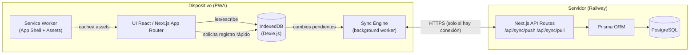

# IMPLEMENTATION_PLAN.md

## Sistema de Gestión Piscícola Offline-First

> Documento de arquitectura y planificación. No contiene aún implementación de código de producto — es el resultado de la **Fase 0 (Análisis y Diseño)**. Todo lo que sigue debe leerse bajo el principio rector del proyecto:
>
> **"No tener Internet es una situación normal, no un error."**

---

## 1. Resumen Ejecutivo

Se construirá una **PWA offline-first** (Next.js + IndexedDB + PostgreSQL/Prisma en Railway) para gestionar el ciclo productivo completo de una piscicultura (especies, estanques, lotes, alimentación, mortalidad, muestreos, calidad de agua, inventario, gastos, cosechas, ventas, tareas y rentabilidad).

El requisito no negociable es que **toda operación de campo se ejecuta contra IndexedDB de forma local e inmediata**, nunca contra la red. La sincronización con PostgreSQL es un proceso **asíncrono, incremental, idempotente y en segundo plano**, que nunca bloquea ni condiciona el trabajo diario.

Prioridades del proyecto, en orden (ver también §12):

1. No perder datos.
2. Funcionar sin Internet.
3. Ser sencilla de usar en campo.
4. Cálculos correctos.
5. Sincronización confiable.
6. Diseño visual.

---

## 2. Principios Rectores del Diseño

| # | Principio | Implicación técnica |
|---|---|---|
| P1 | Local-first | IndexedDB es la base de datos operativa. El servidor es el "libro mayor" consolidado. |
| P2 | Nunca bloquear por red | Ninguna pantalla debe esperar un `fetch` para completar un guardado. |
| P3 | IDs generados en el dispositivo | UUID v4 (`crypto.randomUUID()`) en el cliente, nunca autoincrementales de Postgres. |
| P4 | Ledger, no sobrescritura | Stock, cantidad de peces, biomasa, etc. son **derivados de movimientos**, nunca campos mutables directos. |
| P5 | Idempotencia | Cada operación de sync lleva un id propio; reenviarla dos veces no debe duplicar nada. |
| P6 | Trazabilidad total | Soft-delete (`deletedAt`) en entidades productivas/económicas. Nunca hard-delete silencioso. |
| P7 | Cálculo local | Todo indicador (biomasa, FCR, mortalidad %, stock) se calcula en el cliente contra datos locales; nunca depende de una respuesta del servidor para mostrarse. |
| P8 | Degradación nunca bloqueante | Si falla la sincronización, la app sigue 100% operativa; solo cambia un indicador visual discreto. |

---

## 3. Arquitectura General

### 3.1 Diagrama de alto nivel



### 3.2 Stack tecnológico

| Capa | Tecnología | Justificación |
|---|---|---|
| Framework | Next.js 14+ (App Router, TypeScript) | SSR opcional para landing/login, pero la app autenticada corre como SPA/PWA client-heavy |
| UI | React 18 + Tailwind CSS + componentes accesibles (Radix UI primitives) | Rápido de estilizar, accesible, buen soporte táctil móvil |
| Estado / datos locales | Dexie.js sobre IndexedDB | API madura, transacciones, hooks reactivos (`dexie-react-hooks` → `useLiveQuery`) |
| Validación | Zod (esquemas compartidos cliente/servidor) | Una sola fuente de verdad para reglas de negocio (§52) |
| Base de datos servidor | PostgreSQL (Railway) | Relacional, transaccional, soporta Railway nativo |
| ORM servidor | Prisma | Migraciones versionadas, tipado end-to-end |
| PWA | `next-pwa`/Workbox o service worker manual | Cache de app shell, estrategia offline |
| Autenticación | NextAuth (Credentials) + sesión local persistida | Login inicial online, uso posterior offline (§48) |
| Gráficos | Recharts (simple, liviano en móvil) | Suficiente para dashboards de campo |
| Testing | Vitest (unidad/cálculos), Playwright (E2E, incluye modo offline) | Playwright soporta `context.setOffline()` |
| Hosting | Railway (Web + PostgreSQL) | Requisito explícito, evita Supabase |

### 3.3 Por qué esta arquitectura y no otra

- Se descarta cualquier patrón "cliente pide al servidor y espera" para escritura: rompería el requisito offline.
- Se descarta guardar sólo el "estado actual" (ej. `stock=500`): rompe trazabilidad y complica resolución de conflictos multi-dispositivo. En su lugar, **patrón de libro mayor (ledger)** para todo lo productivo/económico.
- Dexie se elige sobre alternativas (localForage, PouchDB/CouchDB) porque: (a) da control fino de transacciones e índices tipo SQL-like necesarios para joins locales (lote↔estanque↔alimentación), (b) no impone un protocolo de replicación propio como CouchDB (evitamos acoplar a Supabase/servicios específicos), (c) se integra bien con React vía hooks reactivos.

---

## 4. Modelo de Datos

### 4.1 Reglas de modelado transversales

Todas las entidades **productivas/económicas** (siembra, traslado, alimentación, mortalidad, muestreo, movimiento de inventario, gasto, compra, cosecha, venta) son **inserciones inmutables** (append-only). No se editan cantidades pasadas: se corrige con un nuevo movimiento de ajuste, manteniendo el historial.

Todas las entidades (excepto tablas de catálogo puro) incluyen estos campos de auditoría/sincronización:

```
id            String  @id (uuid, generado en cliente)
createdAt     DateTime
updatedAt     DateTime
deletedAt     DateTime?      // soft delete
version       Int     @default(1)   // para resolución de conflictos
deviceId      String          // dispositivo que originó el último cambio
createdBy     String?         // userId
updatedBy     String?
```

### 4.2 Entidades principales (agrupadas por dominio)

**Identidad y configuración**
- `User` (id, name, email, passwordHash, role: ADMIN|MANAGER|WORKER|READONLY, active)
- `Device` (id, userId, label, lastSeenAt, platform)
- `FarmSettings` (nombre piscicultura, currency="BOB", unidades, singleton lógico)

**Catálogos**
- `Species` (campos según §11: nombre, nombreCientifico, pesoObjetivo, duraciónEstimada, rangos T°/pH/O2, fcrEsperado, mortalidadEsperada, activo)
- `Feed` (según §19: nombre, marca, proteína%, pesoPorSaco, costoPorSaco, costoPorKg calculado, stockMinimo, activo)
- `Supplier`, `Customer` (según §31/§32)

**Producción**
- `Pond` (según §12: código, nombre, dimensiones, superficie/volumen calculados, estado, ubicación)
- `FishBatch` (según §13: código auto PAC-2026-001, speciesId, fechas, cantidadInicial, pesoInicial, costoAlevines, estado, pesoObjetivo)
  - **cantidad actual y biomasa nunca se guardan como campo mutable**: se derivan (§14, §24) de `Stocking` + `MortalityRecord` + `Harvest` + `FishTransfer`
- `Stocking` (siembra: loteId, pondId, fecha, cantidad, pesoPromedio, biomasa)
- `FishTransfer` (traslado: loteId, pondOrigenId, pondDestinoId, cantidad, pesoPromedio, motivo, fecha) — mantiene `BatchPondHistory` como vista derivada del historial de ubicaciones
- `Sampling` (muestreo: loteId, pondId, fecha, pecesMuestreados, pesoTotalMuestra → pesoPromedio calculado)

**Operación diaria**
- `FeedingRecord` (según §17: fecha, hora, pondId, loteId, feedId, cantidadKg, turno) → genera automáticamente 1 `InventoryMovement` tipo CONSUMPTION vinculado (mismo `id` de referencia, para evitar duplicados en reintentos)
- `FeedingPlan` (opcional/recomendación: speciesId/etapa, porcentajeBiomasa, racionesPorDia) — nunca sustituye al registro real
- `InventoryItem` (feedId u otro insumo, ubicación) — el stock es siempre `SUM(InventoryMovement)`
- `InventoryMovement` (tipo: PURCHASE|CONSUMPTION|ADJUSTMENT_IN|ADJUSTMENT_OUT|LOSS|RETURN, cantidad, referenciaEntidad)
- `MortalityRecord` (según §22)
- `WaterQualityRecord` (según §27, campos opcionales salvo mínimos)

**Economía**
- `Purchase` (compras a proveedor, ej. alevines/insumos)
- `Expense` (según §29, categoría configurable)
- `Harvest` (según §33: parcial/total, pesoPromedio calculado)
- `Sale` (según §34: importe calculado = kg × precio/kg, estado de pago)

**Planificación**
- `Task` (según §37, estados pendiente/completada/cancelada)

**Sincronización**
- `SyncOperation` (log servidor de operaciones procesadas: `operationId` (uuid, único), `entityType`, `entityId`, `deviceId`, `processedAt`, `result`) — es la pieza clave de **idempotencia** server-side
- (Cliente) `SyncQueue`/`Outbox`: tabla local, ver §6.2

### 4.3 Relaciones clave (resumen)

```
Species 1─N FishBatch
Pond    1─N Stocking, FishTransfer(origen/destino), FeedingRecord, MortalityRecord, Sampling, WaterQualityRecord
FishBatch 1─N Stocking, FishTransfer, FeedingRecord, MortalityRecord, Sampling, Harvest, Sale
Feed    1─N FeedingRecord, InventoryMovement, Purchase
FeedingRecord 1─1 InventoryMovement (vínculo transaccional, §56)
Supplier 1─N Purchase, (opcional en Expense)
Customer 1─N Sale
User    1─N Device
```

### 4.4 Esquema Prisma (borrador conceptual, se refinará en Fase 1)

```prisma
model FishBatch {
  id               String    @id @default(uuid())
  code             String    @unique
  speciesId        String
  species          Species   @relation(fields: [speciesId], references: [id])
  purchaseDate     DateTime?
  stockingDate     DateTime?
  initialQuantity  Int
  initialAvgWeight Decimal?
  initialTotalWeight Decimal?
  supplier         String?
  fingerlingCost   Decimal?
  status           BatchStatus @default(PLANNED)
  targetWeight     Decimal?
  estimatedHarvestDate DateTime?
  notes            String?

  createdAt DateTime  @default(now())
  updatedAt DateTime  @updatedAt
  deletedAt DateTime?
  version   Int       @default(1)
  deviceId  String
  createdBy String?
  updatedBy String?

  stockings      Stocking[]
  transfers      FishTransfer[]
  feedingRecords FeedingRecord[]
  mortalities    MortalityRecord[]
  samplings      Sampling[]
  harvests       Harvest[]
  sales          Sale[]
}
```
*(Se completará el resto de modelos siguiendo el mismo patrón en Fase 1; este documento fija el criterio, no el DDL final.)*

### 4.5 Espejo local (Dexie / IndexedDB)

Cada tabla del servidor relevante para trabajo de campo tiene una tabla espejo en Dexie con **el mismo `id` (uuid)** que en Postgres, más las tablas exclusivamente locales:

```ts
// db/schema.ts (Dexie)
this.version(1).stores({
  species: 'id, active',
  ponds: 'id, status',
  fishBatches: 'id, speciesId, status, code',
  stockings: 'id, fishBatchId, pondId, date',
  fishTransfers: 'id, fishBatchId, date',
  samplings: 'id, fishBatchId, date',
  feeds: 'id, active',
  feedingRecords: 'id, pondId, fishBatchId, date',
  inventoryMovements: 'id, feedId, type, createdAt',
  mortalityRecords: 'id, pondId, fishBatchId, date',
  waterQualityRecords: 'id, pondId, date',
  suppliers: 'id',
  customers: 'id',
  purchases: 'id, supplierId, date',
  expenses: 'id, category, date',
  harvests: 'id, fishBatchId, date',
  sales: 'id, customerId, date',
  tasks: 'id, status, date',
  farmSettings: 'id',
  syncQueue: 'id, status, entityType, createdAt',
  syncMeta: 'key', // lastSyncedAt, deviceId, etc.
});
```

---

## 5. Estrategia Offline-First

### 5.1 Flujo de escritura (regla única, sin excepciones)

```
Usuario completa formulario
        ↓
Validación local (Zod) — misma validación que en servidor
        ↓
Transacción Dexie:
   1. INSERT/UPDATE en la tabla de dominio (con id uuid ya asignado)
   2. Si aplica, INSERT del movimiento derivado (ej. InventoryMovement)
   3. INSERT en syncQueue (una entrada por entidad afectada)
        ↓
UI se actualiza al instante vía useLiveQuery (sin esperar red)
        ↓
Sync Engine detecta cola pendiente → intenta sincronizar SI hay conexión
```

Nunca existe una llamada `await fetch(...)` en el camino crítico de guardar un registro.

### 5.2 Flujo de lectura

Todas las pantallas leen exclusivamente de Dexie mediante `useLiveQuery`. La API del servidor **nunca se consulta para renderizar** vistas operativas del día a día; sólo se usa para el proceso de sincronización (`pull`) que alimenta a Dexie en segundo plano.

### 5.3 Identificadores

- UUID v4 generado en el dispositivo en el momento de creación (`crypto.randomUUID()`).
- Se usa como PK tanto en Dexie como en Postgres → nunca hay remapeo de IDs al sincronizar, lo cual simplifica enormemente relaciones creadas offline (ej. crear un lote y una siembra en el mismo momento, ambos offline, referenciándose entre sí).

### 5.4 Cálculos 100% locales

Cantidad actual de peces, biomasa, FCR, stock, mortalidad %, costo/kg, rentabilidad: todos son **funciones puras** (`/lib/calculations`) que leen únicamente de las tablas locales Dexie. Se documentan explícitamente sus fórmulas y fuente de datos (fechas/registros usados) para evitar cálculos engañosos (§26). Si faltan datos suficientes, la función retorna un estado explícito `insufficient_data`, nunca un número inventado.

### 5.5 Persistencia y cuota de almacenamiento

- Al primer login exitoso se solicita `navigator.storage.persist()` para reducir el riesgo de que el navegador purgue IndexedDB bajo presión de espacio.
- Se sincroniza incrementalmente (no se descarga histórico completo indefinidamente) para mantener el tamaño local razonable (ver §58 y Riesgo R4).

### 5.6 Autenticación offline

- Login requiere red la primera vez (o primera vez por dispositivo).
- Tras autenticar, se guarda una sesión local firmada (JWT de corta/media duración + refresh silencioso cuando hay red) en IndexedDB/almacenamiento seguro del navegador.
- Mientras el token no haya expirado, la app funciona completamente offline sin pedir login de nuevo. La expiración se fija con margen amplio (ej. 30 días) para el escenario de campo sin señal por varios días, y se renueva automáticamente en segundo plano cuando hay conexión.

---

## 6. Estrategia de Sincronización

### 6.1 Disparadores del sync

El Sync Engine se ejecuta:
1. Al abrir la aplicación.
2. Al detectar evento `online` del navegador.
3. Manualmente, botón "Sincronizar ahora".
4. Periódicamente (intervalo, ej. cada 5 min) mientras la app está abierta y hay conexión.

*(Nota de riesgo: en iOS/Safari no existe Background Sync API confiable con la app cerrada; se documenta esta limitación — la sincronización real ocurre mientras la app está en primer/segundo plano abierto. Ver Riesgo R5.)*

### 6.2 Cola de sincronización (Outbox)

Tabla local `syncQueue`:

| Campo | Tipo | Notas |
|---|---|---|
| id | uuid | id de la operación (usado como idempotency key) |
| entityType | string | ej. `FeedingRecord` |
| entityId | uuid | id de la entidad afectada |
| operation | enum | CREATE / UPDATE / DELETE |
| payload | json | snapshot completo de la entidad al momento de encolar |
| createdAt | datetime | |
| retryCount | int | |
| status | enum | pending / syncing / synced / error |
| errorMessage | string? | |

### 6.3 Proceso de sync

```
1. Cliente agrupa entradas "pending" de syncQueue (lote pequeño, ej. 50)
2. POST /api/sync/push { operations: [...], deviceId }
3. Servidor, en una transacción Prisma por operación (o batch):
     - Si operationId ya existe en SyncOperation → responde "ya procesado" (idempotente, no reaplica)
     - Si no existe → aplica upsert por entityId, respetando reglas de conflicto (6.4)
     - Registra en SyncOperation
4. Servidor responde resultado por operación: { id, status: applied|duplicate|conflict|error }
5. Cliente marca cada entrada de syncQueue como "synced" o "error" según respuesta
6. Cliente hace GET /api/sync/pull?since=<lastSyncedAt>&deviceId=...
7. Servidor devuelve cambios de otras fuentes desde esa fecha
8. Cliente aplica esos cambios a Dexie (upsert), actualiza syncMeta.lastSyncedAt
```

### 6.4 Resolución de conflictos

Estrategia de dos niveles, según el tipo de entidad:

**A. Entidades de configuración/estado mutable** (Pond, FishBatch.status, Species, FarmSettings, Task): *last-write-wins* comparando `version`/`updatedAt`. Si el servidor tiene una versión más nueva que la que el cliente tenía como base, el cliente pierde esa escritura puntual pero **nunca se descarta silenciosamente**: se registra en `syncQueue` como `status=error` con motivo `conflict`, visible en la UI de sincronización para revisión manual si aplica.

**B. Entidades productivas/económicas** (FeedingRecord, MortalityRecord, Sampling, WaterQualityRecord, InventoryMovement, Expense, Purchase, Harvest, Sale, FishTransfer, Stocking): son **append-only por diseño** → prácticamente no hay conflictos de contenido porque no se editan, solo se insertan (con `entityId` uuid propio). El único caso de "conflicto" es un soft-delete concurrente, resuelto también por versión.

Esta decisión de diseño (ledger pattern) es la mitigación principal contra pérdida de datos en escenarios multi-dispositivo (§8, §77).

### 6.5 Idempotencia

- Cada operación de `syncQueue` tiene un `id` propio (no confundir con `entityId`) que se usa como clave única en `SyncOperation.operationId` del servidor.
- Reenviar la misma operación (por reintento de red) es un no-op detectado por esa clave única antes de tocar la tabla de negocio.
- El vínculo `FeedingRecord` → `InventoryMovement` (§56) se crea en la **misma operación/transacción** del lado servidor, referenciando el mismo `entityId` de origen, evitando duplicar el movimiento de inventario en reintentos.

### 6.6 Indicador de estado en UI

Badge persistente y discreto (según §7/§46):

- 🟢 Sincronizado
- 🟠 N cambios pendientes
- 🔴 Error de sincronización (con acceso a detalle/reintento)
- ⚫ Sin conexión

Más: "Última sincronización: dd/mm/aaaa hh:mm" y botón "Sincronizar ahora". Nunca se muestra un error técnico crudo al usuario de campo.

---

## 7. PWA

- `manifest.webmanifest`: nombre, iconos (192/512, maskable), `display: standalone`, `theme_color`, `start_url`.
- Service worker (Workbox vía `next-pwa` o configuración manual con `serwist`): cachea el app shell (JS/CSS/rutas principales) con estrategia `StaleWhileRevalidate` para assets estáticos y `NetworkFirst` con fallback a caché para rutas de navegación.
- No existe una "pantalla offline" bloqueante: si falta un recurso no crítico, se degrada; los datos siempre vienen de IndexedDB, nunca de un fetch a la API para renderizar.
- Prompt discreto de instalación ("Instalar aplicación") usando el evento `beforeinstallprompt`, sin forzar.
- Estrategia de actualización de versión: `skipWaiting` + aviso "Nueva versión disponible, recargar" controlado por el usuario (para no interrumpir un registro en curso).

---

## 8. Estructura de Carpetas (propuesta Fase 1)

```
/prisma
  schema.prisma
  seed.ts                     # datos demo activables (§63)
  /migrations
/src
  /app
    /(auth)/login/page.tsx
    /(app)/                   # shell autenticado
      layout.tsx              # navegación principal + indicador de sync
      dashboard/page.tsx
      estanques/[id]/page.tsx
      produccion/
        lotes/...
        especies/...
        siembras/...
        traslados/...
        muestreos/...
      alimentacion/
        registro/...
        plan/...
        inventario/...
      mortalidad/...
      calidad-agua/...
      inventario/...
      compras/...
      gastos/...
      cosechas/...
      ventas/...
      tareas/...
      informes/...
      configuracion/...
    /api
      /sync/push/route.ts
      /sync/pull/route.ts
      /auth/[...nextauth]/route.ts
    manifest.ts
  /components
    /ui                       # botones grandes, inputs táctiles, cards
    /forms                    # formularios de registro rápido
    /dashboard
    /pond
    /sync                     # badge de estado, botón "sincronizar ahora"
  /lib
    /db                       # Dexie: schema.ts, repositories/*.ts
    /sync                     # engine.ts, push.ts, pull.ts, conflict.ts
    /calculations             # biomasa.ts, fcr.ts, stock.ts, mortalidad.ts, rentabilidad.ts (+ tests)
    /validation                # esquemas zod compartidos
    /auth
    /utils
  /hooks
    useOnlineStatus.ts
    useSyncStatus.ts
    useLiveQuery wrappers específicos
  /types
/public
  /icons
/tests
  /unit                       # cálculos críticos (§64)
  /e2e                        # Playwright, incluye escenario offline (§65)
README.md
ARCHITECTURE.md
IMPLEMENTATION_PLAN.md
.env.example
```

---

## 9. Fases de Implementación

| Fase | Contenido | Criterio de aceptación |
|---|---|---|
| **0 (actual)** | Análisis, arquitectura, este documento | Documento revisado, sin bloqueos críticos pendientes |
| **1 — Base técnica** | Next.js/TS/Tailwind/Prisma/Postgres/Railway-ready, PWA base, Dexie + syncQueue, motor de sync mínimo (push/pull), layout y navegación, indicador de conexión | Se puede crear un registro offline de prueba y verlo sincronizado en Postgres al reconectar, sin duplicados |
| **2 — Producción** | Species, Pond, FishBatch, Stocking, FishTransfer | Se puede crear especie → estanque → lote → siembra, todo offline |
| **3 — Operación diaria** | FeedingRecord (+InventoryMovement vinculado), Feed/inventario, MortalityRecord, Sampling, cálculo de biomasa | Registro rápido de alimentación en ≤3 toques; stock e indicadores consistentes |
| **4 — Agua y planificación** | WaterQualityRecord + alertas por especie, Task, Calendario | Alertas visibles sin diagnosticar enfermedades; tareas offline |
| **5 — Economía** | Supplier, Purchase, Expense, Customer, Harvest, Sale, rentabilidad por lote | Flujo cosecha→venta→rentabilidad correcto y trazable |
| **6 — Analítica** | Dashboard avanzado, gráficos, FCR, informes filtrables | FCR documentado (fuente exacta de datos), "datos insuficientes" cuando corresponda |
| **7 — Hardening** | Prueba offline obligatoria (§65/§80) end-to-end, resolución de conflictos, rendimiento, seguridad, deploy Railway documentado | Escenario completo de §80 pasa sin pérdida ni duplicación |

Cada fase cierra con: lint → typecheck → tests → build, antes de pasar a la siguiente (§69/§70).

---

## 10. Riesgos Técnicos y Mitigaciones

| # | Riesgo | Impacto | Mitigación |
|---|---|---|---|
| R1 | Duplicación de registros por reintentos de sync en conexión inestable | Alto (dato económico duplicado) | Idempotencia por `operationId` único en servidor (§6.5); upsert por `entityId` uuid |
| R2 | Pérdida de datos por conflicto entre dispositivos | Alto | Patrón ledger para todo lo productivo/económico (append-only); LWW versionado solo para config mutable, con registro visible de conflicto (§6.4) |
| R3 | Eviction de IndexedDB por el navegador (especialmente iOS Safari, poca memoria) | Alto | `navigator.storage.persist()`, sincronización frecuente que reduce ventana de exposición, aviso si `persist()` es denegado |
| R4 | Crecimiento indefinido de datos locales tras meses/años de uso | Medio | Sincronización incremental (`pull since=lastSyncedAt`), poda de datos históricos poco usados localmente con posibilidad de recarga on-demand cuando haya red |
| R5 | iOS no soporta Background Sync real con app cerrada | Medio | Documentar la limitación; sync se dispara en foreground/reconexión/manual/intervalo mientras la app está abierta; no se promete sync con app cerrada |
| R6 | Desalineación entre versión de esquema Dexie local y esquema Prisma del servidor tras actualizaciones de la app | Alto | Versionado explícito de Dexie (`db.version(n).stores(...)`) con migraciones locales; validación de compatibilidad de versión de API en el handshake de sync |
| R7 | Cálculos incorrectos o engañosos (FCR, biomasa) por mezclar datos de distintos periodos | Alto | Funciones de cálculo puras y testeadas (§64), con documentación explícita de qué fechas/registros usan; estado `datos insuficientes` explícito en vez de inventar resultados |
| R8 | Formularios complejos que ralentizan el registro en campo | Medio | UX mobile-first, "Registro rápido" con valores predeterminados inteligentes (último estanque usado, turno actual, etc.) |
| R9 | Autenticación bloqueando el uso tras varios días offline | Alto | Sesión local de larga duración con renovación silenciosa; nunca forzar login mientras el token local siga siendo válido |
| R10 | Race condition entre escritura local y proceso de sync leyendo la cola simultáneamente | Medio | Procesamiento secuencial de la cola (un solo "worker" lógico de sync), payload como snapshot inmutable al momento de encolar |
| R11 | Validaciones de negocio (§52) distintas entre cliente y servidor generando inconsistencias | Medio | Esquemas Zod compartidos entre `/lib/validation` (cliente) y API routes (servidor); servidor nunca confía solo en el cliente |
| R12 | Migraciones Prisma rompiendo despliegue automático en Railway | Medio | Pipeline de deploy documentado: build → `prisma migrate deploy` → start, ejecutado automáticamente por Railway en cada push (§73) |

---

## 11. Estrategia de Pruebas

- **Unitarias (Vitest)**: todas las fórmulas de §64 — peces actuales, biomasa, alimentación diaria recomendada, FCR, inventario, costo/kg, ventas, mortalidad %.
- **Sincronización**: pruebas de no-duplicación al reenviar la misma operación, comportamiento ante error/reintento, aplicación de conflictos.
- **E2E offline obligatorio (Playwright, §65/§80)**: escenario scripted que abre la app, sincroniza, corta la red (`context.setOffline(true)`), cierra/reabre la app, registra alimentación/mortalidad/muestreo/gasto, verifica persistencia tras reabrir offline, reconecta, sincroniza, y valida en Postgres que no hay duplicados. Este test es **bloqueante** antes de dar por cerrada la Fase 7.

---

## 12. Checklist de Cobertura de Requisitos Críticos

- [x] Offline-first real: lectura y escritura 100% contra IndexedDB, sin llamada de red en el camino crítico (§4, §5 de requisitos → §5 de este plan).
- [x] Cola de sincronización con estados pending/syncing/synced/error (§5 de requisitos → §6.2).
- [x] IDs UUID generados en dispositivo (§6 de requisitos → §5.3).
- [x] Sincronización disparada en apertura/reconexión/manual/periódica, con indicadores visuales (§7 → §6.1/§6.6).
- [x] Arquitectura preparada para conflictos multi-dispositivo con `version`/`updatedAt`/`deviceId` (§8 → §6.4).
- [x] Movimientos productivos/económicos como registros independientes, no sobrescrituras (§8 → §4.1, §6.4-B).
- [x] Idempotencia de la API de sync (§55 → §6.3/§6.5).
- [x] Transacciones vinculadas (alimentación ↔ movimiento de inventario) sin duplicar en reintentos (§56 → §6.5).
- [x] Autenticación que no exige red en cada apertura (§48 → §5.6).
- [x] Pantalla "sin conexión" nunca bloqueante (§61 → §7).
- [x] Prueba offline obligatoria como criterio de cierre (§65/§80 → §11).
- [x] No codificar especies fijas: catálogo `Species` configurable (§11 → §4.2).
- [x] No guardar cantidades mutables (stock, peces actuales): siempre derivadas de movimientos (§14, §20 → §4.1).

No se identifican requisitos críticos del enunciado sin cobertura arquitectónica en este plan. Los detalles de UI específicos (copys, disposición exacta de tarjetas) se resolverán durante la implementación de cada fase siguiendo los ejemplos dados en el enunciado.

---

## 13. Próximos Pasos

Con este plan aprobado, la **Fase 1** arranca con:
1. Bootstrap del proyecto Next.js + TypeScript + Tailwind.
2. `prisma init` + primer `schema.prisma` completo (todas las entidades de §4).
3. Configuración de Dexie con el esquema de §4.5 y repositorios base.
4. Implementación del motor de sincronización mínimo (push/pull + idempotencia).
5. Layout, navegación principal y componente de estado de sincronización.
6. Configuración de PWA (manifest + service worker).
7. `README.md` y `ARCHITECTURE.md` (detalle operativo de lo aquí decidido).

Cada entrega de fase se valida con lint, typecheck, tests y build antes de continuar, según §69/§70.
