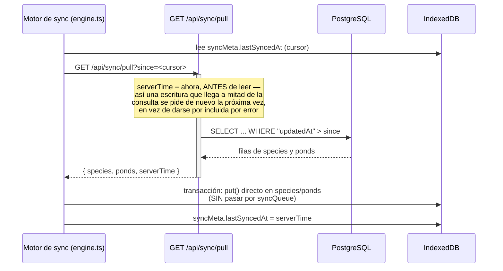
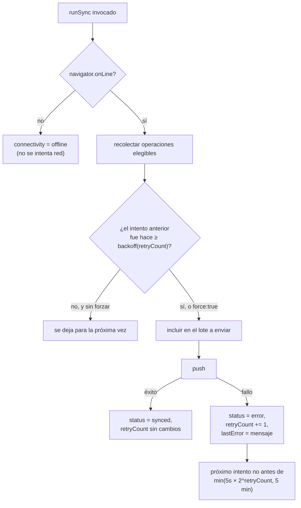
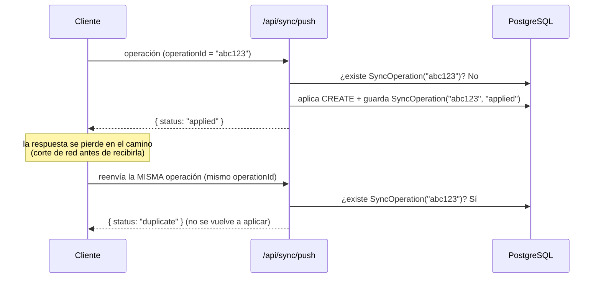
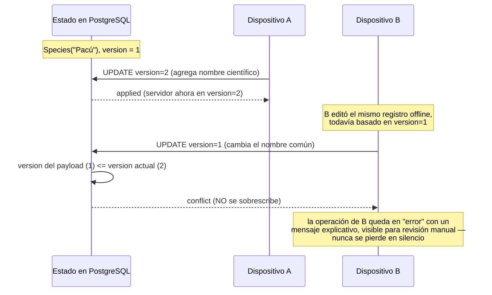

# OFFLINE_SYNC.md

Cómo funciona, en detalle, el modo offline-first y la sincronización de
esta aplicación. Complementa `IMPLEMENTATION_PLAN.md` §5-§6 (el diseño) y
`ARCHITECTURE.md` (dónde vive cada pieza en el código).

## 1. Escritura offline

Ninguna pantalla espera nunca a la red para guardar algo. El flujo es
siempre el mismo, sea cual sea la entidad:

```mermaid
sequenceDiagram
    participant UI as Página (ej. /especies)
    participant Repo as Repositorio (src/lib/db/repositories)
    participant Dexie as IndexedDB (Dexie)

    UI->>Repo: createSpecies({ commonName: "Pacú" })
    activate Repo
    Note over Repo: genera id (UUID v4),<br/>deviceId, timestamps, version=1
    Repo->>Dexie: transacción rw (species + syncQueue)
    activate Dexie
    Dexie->>Dexie: species.add(registro)
    Dexie->>Dexie: syncQueue.add({ operationId, entityType,<br/>entityId, operation: "CREATE", payload, status: "pending" })
    Dexie-->>Repo: transacción confirmada (ambas escrituras o ninguna)
    deactivate Dexie
    Repo-->>UI: registro creado
    deactivate Repo
    Note over UI: useLiveQuery ya refleja el cambio;<br/>no hubo ninguna llamada de red
```

Las tres operaciones (crear, actualizar, eliminar lógicamente) comparten
esta misma garantía en `src/lib/db/repositories/base.ts`: la escritura de
dominio y su entrada en `syncQueue` ocurren en **una sola transacción
Dexie**. Si el navegador se cierra a mitad de camino, Dexie asegura que se
aplicó todo o nada — nunca queda un dato guardado sin su operación de
sincronización pendiente.

## 2. Push (enviar cambios locales al servidor)

```mermaid
sequenceDiagram
    participant Engine as Motor de sync (engine.ts)
    participant API as POST /api/sync/push
    participant Prisma as Prisma (transacción)
    participant PG as PostgreSQL

    Engine->>Engine: recolecta operaciones "pending"/"error"<br/>listas para reintentar (respeta backoff)
    Engine->>Dexie: marca esas operaciones como "syncing"
    Engine->>API: { deviceId, operations: [...] }
    activate API
    API->>API: valida cada operación con Zod
    loop por cada operación
        API->>Prisma: ¿existe SyncOperation con este operationId?
        alt ya existe
            Prisma-->>API: sí → "duplicate" (no se reaplica)
        else no existe
            API->>Prisma: transacción: aplicar CREATE/UPDATE/DELETE<br/>+ crear SyncOperation(operationId, status)
            Prisma->>PG: escribe
            PG-->>Prisma: ok
            Prisma-->>API: "applied" (o "conflict", ver §5)
        end
    end
    API-->>Engine: { results: [{ id, status }], serverTime }
    deactivate API
    Engine->>Dexie: "applied"/"duplicate" → synced;<br/>"conflict"/"error" → error (con mensaje)
    Engine->>Dexie: purga las operaciones "synced"
```

## 3. Pull (traer cambios del servidor)



**Por qué el pull no pasa por `syncQueue`**: si un registro que acaba de
llegar del servidor se volviera a encolar como si fuera un cambio local,
el dispositivo se lo reenviaría al servidor en el próximo push —
generando tráfico inútil como mínimo, y en el peor caso un bucle. `put()`
directo sobre las tablas de Dexie evita esto por construcción.

Es además **incremental**: nunca se descarga la base completa, solo lo
que cambió desde el cursor guardado (§58 del encargo: rendimiento).

## 4. Reintentos y backoff



- Cada operación se intenta **como máximo una vez por llamada a
  `runSync`** — nunca hay un bucle interno que reintente hasta tener
  éxito. Los reintentos vienen de que algo vuelve a llamar a `runSync`
  más tarde: el intervalo periódico (cada 60 s), el evento `online` del
  navegador, o el botón "Sincronizar ahora" (que además fuerza a ignorar
  el backoff con `force: true`). Esto evita que un fallo persistente de
  red pueda causar un bucle infinito.
- El dato **nunca se pierde** por un fallo de sincronización: sigue en
  IndexedDB, visible y editable, con su badge en 🟠/🔴 indicando que
  falta enviarlo.

## 5. Idempotencia

El requisito crítico: reenviar la misma operación (por un corte de
conexión a mitad de la respuesta, por ejemplo) nunca debe duplicar su
efecto.



`operationId` es, en el cliente, el mismo `id` de la entrada en
`syncQueue` — estable mientras esa operación no se haya confirmado
sincronizada, sin importar cuántas veces se reintente. En el servidor,
`SyncOperation.operationId` tiene una restricción `UNIQUE`: si dos
solicitudes con el mismo `operationId` llegaran en paralelo, la base de
datos rechaza la segunda inserción por la restricción única — no hay
ninguna ventana de carrera donde ambas puedan aplicarse. Verificado con
un test real (no solo unitario): la misma operación de creación enviada
tres veces contra un PostgreSQL real deja exactamente una fila (ver
`src/app/api/sync/__tests__/sync.integration.test.ts` y
`tests/e2e/offline.spec.ts`, paso 5).

## 6. Conflictos

Estrategia: **last-write-wins por número de versión**, nunca por
timestamp (los relojes de dispositivos no son confiables).



Este mecanismo solo importa para entidades con campos editables
(`Species`, `Pond` en esta fase). Los movimientos productivos/económicos
del dominio completo (alimentación, mortalidad, ventas...) se diseñan
como registros *append-only* (§8/§77 del encargo): al no editarse nunca,
prácticamente no generan conflictos de contenido — ver
`IMPLEMENTATION_PLAN.md` §4.1 y §6.4.

## 7. Qué pasa si el servidor está caído (no el dispositivo)

Desde el punto de vista del cliente es indistinguible de estar offline:
`fetch()` falla, la operación queda en `error` con backoff, y el dato
sigue intacto en IndexedDB. En cuanto el servidor vuelve a responder, el
siguiente intento (automático o manual) la sincroniza con normalidad —
sin ninguna acción especial de recuperación. Verificado en
`tests/e2e/offline.spec.ts` (paso 6), interceptando y luego liberando las
solicitudes a `/api/sync/push` para simular una caída y recuperación
reales del servidor.
