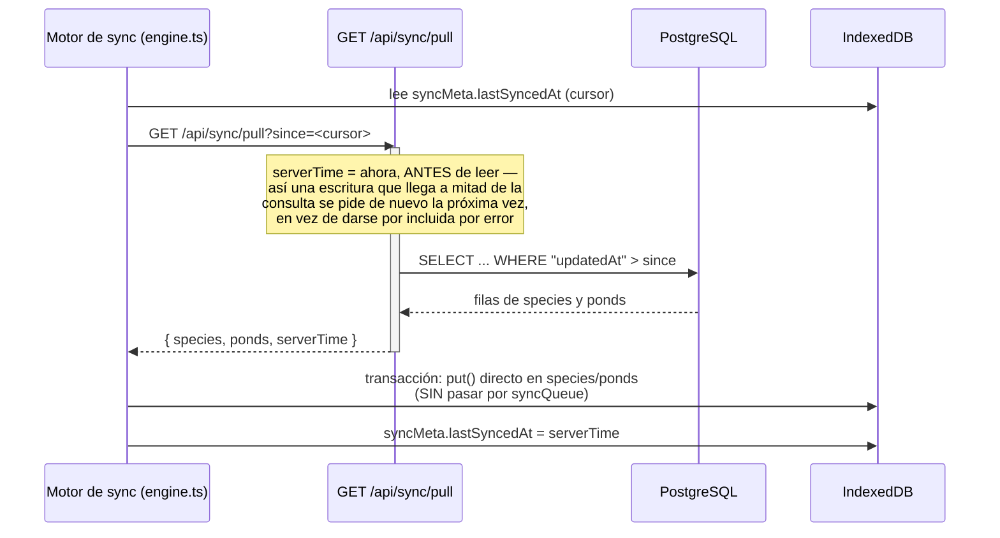
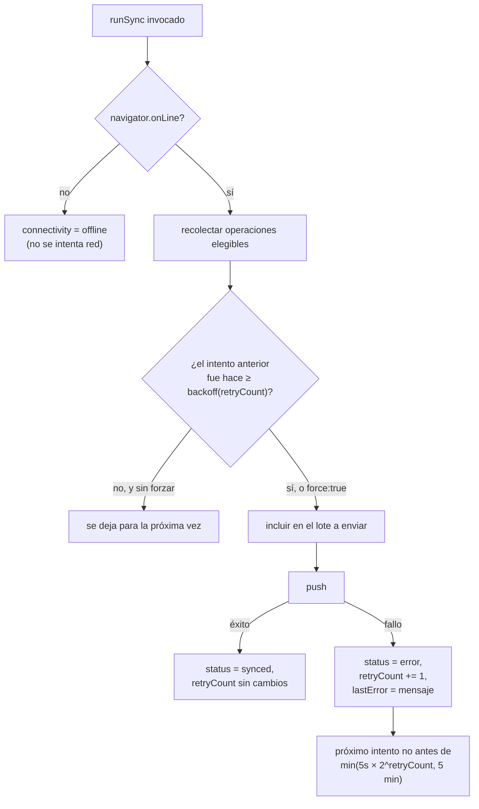
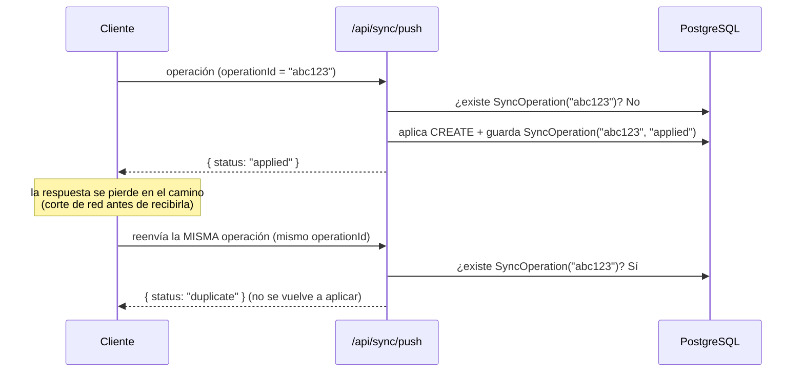
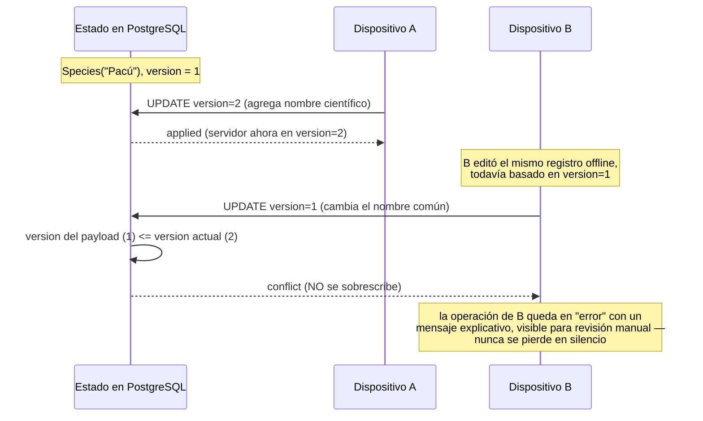
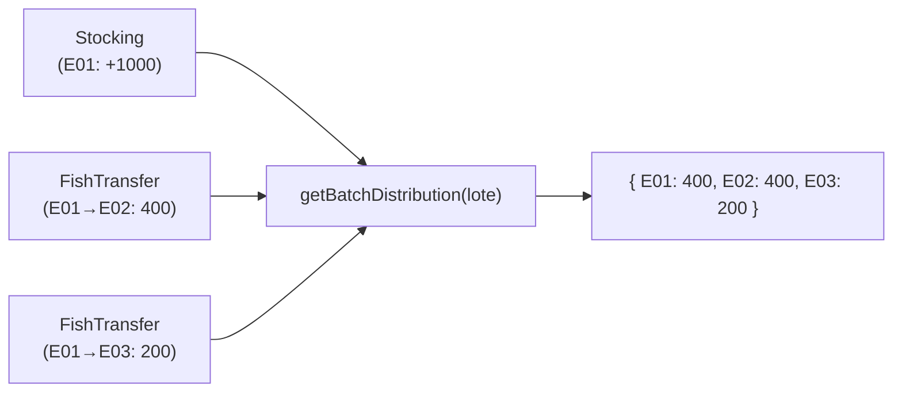
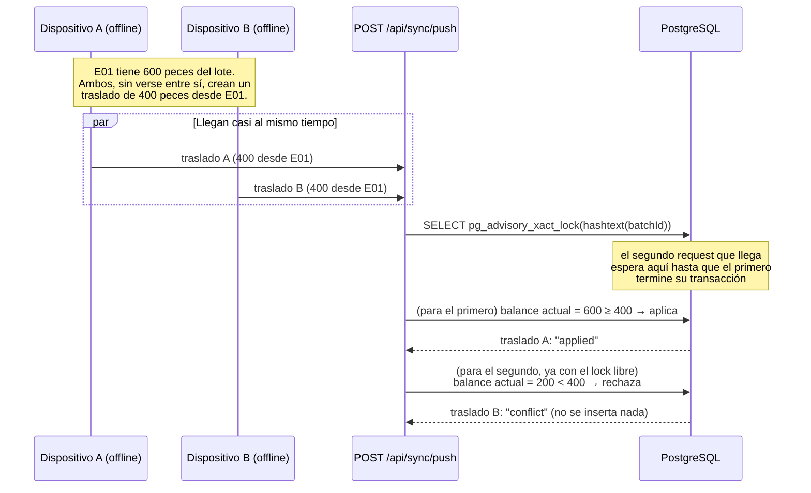

# OFFLINE_SYNC.md

Cómo funciona, en detalle, el modo offline-first y la sincronización de
esta aplicación. Complementa `IMPLEMENTATION_PLAN.md` §5-§6 (el diseño) y
`ARCHITECTURE.md` (dónde vive cada pieza en el código).

## 1. Escritura offline

Ninguna pantalla espera nunca a la red para guardar algo. El flujo es
siempre el mismo, sea cual sea la entidad:

```mermaid
sequenceDiagram
    participant UI as Página (ej. /especies)
    participant Repo as Repositorio (src/lib/db/repositories)
    participant Dexie as IndexedDB (Dexie)

    UI->>Repo: createSpecies({ commonName: "Pacú" })
    activate Repo
    Note over Repo: genera id (UUID v4),<br/>deviceId, timestamps, version=1
    Repo->>Dexie: transacción rw (species + syncQueue)
    activate Dexie
    Dexie->>Dexie: species.add(registro)
    Dexie->>Dexie: syncQueue.add({ operationId, entityType,<br/>entityId, operation: "CREATE", payload, status: "pending" })
    Dexie-->>Repo: transacción confirmada (ambas escrituras o ninguna)
    deactivate Dexie
    Repo-->>UI: registro creado
    deactivate Repo
    Note over UI: useLiveQuery ya refleja el cambio;<br/>no hubo ninguna llamada de red
```

Las tres operaciones (crear, actualizar, eliminar lógicamente) comparten
esta misma garantía en `src/lib/db/repositories/base.ts`: la escritura de
dominio y su entrada en `syncQueue` ocurren en **una sola transacción
Dexie**. Si el navegador se cierra a mitad de camino, Dexie asegura que se
aplicó todo o nada — nunca queda un dato guardado sin su operación de
sincronización pendiente.

## 2. Push (enviar cambios locales al servidor)

```mermaid
sequenceDiagram
    participant Engine as Motor de sync (engine.ts)
    participant API as POST /api/sync/push
    participant Prisma as Prisma (transacción)
    participant PG as PostgreSQL

    Engine->>Engine: recolecta operaciones "pending"/"error"<br/>listas para reintentar (respeta backoff)
    Engine->>Dexie: marca esas operaciones como "syncing"
    Engine->>API: { deviceId, operations: [...] }
    activate API
    API->>API: valida cada operación con Zod
    loop por cada operación
        API->>Prisma: ¿existe SyncOperation con este operationId?
        alt ya existe
            Prisma-->>API: sí → "duplicate" (no se reaplica)
        else no existe
            API->>Prisma: transacción: aplicar CREATE/UPDATE/DELETE<br/>+ crear SyncOperation(operationId, status)
            Prisma->>PG: escribe
            PG-->>Prisma: ok
            Prisma-->>API: "applied" (o "conflict", ver §5)
        end
    end
    API-->>Engine: { results: [{ id, status }], serverTime }
    deactivate API
    Engine->>Dexie: "applied"/"duplicate" → synced;<br/>"conflict"/"error" → error (con mensaje)
    Engine->>Dexie: purga las operaciones "synced"
```

## 3. Pull (traer cambios del servidor)



**Por qué el pull no pasa por `syncQueue`**: si un registro que acaba de
llegar del servidor se volviera a encolar como si fuera un cambio local,
el dispositivo se lo reenviaría al servidor en el próximo push —
generando tráfico inútil como mínimo, y en el peor caso un bucle. `put()`
directo sobre las tablas de Dexie evita esto por construcción.

Es además **incremental**: nunca se descarga la base completa, solo lo
que cambió desde el cursor guardado (§58 del encargo: rendimiento).

## 4. Reintentos y backoff



- Cada operación se intenta **como máximo una vez por llamada a
  `runSync`** — nunca hay un bucle interno que reintente hasta tener
  éxito. Los reintentos vienen de que algo vuelve a llamar a `runSync`
  más tarde: el intervalo periódico (cada 60 s), el evento `online` del
  navegador, o el botón "Sincronizar ahora" (que además fuerza a ignorar
  el backoff con `force: true`). Esto evita que un fallo persistente de
  red pueda causar un bucle infinito.
- El dato **nunca se pierde** por un fallo de sincronización: sigue en
  IndexedDB, visible y editable, con su badge en 🟠/🔴 indicando que
  falta enviarlo.

## 5. Idempotencia

El requisito crítico: reenviar la misma operación (por un corte de
conexión a mitad de la respuesta, por ejemplo) nunca debe duplicar su
efecto.



`operationId` es, en el cliente, el mismo `id` de la entrada en
`syncQueue` — estable mientras esa operación no se haya confirmado
sincronizada, sin importar cuántas veces se reintente. En el servidor,
`SyncOperation.operationId` tiene una restricción `UNIQUE`: si dos
solicitudes con el mismo `operationId` llegaran en paralelo, la base de
datos rechaza la segunda inserción por la restricción única — no hay
ninguna ventana de carrera donde ambas puedan aplicarse. Verificado con
un test real (no solo unitario): la misma operación de creación enviada
tres veces contra un PostgreSQL real deja exactamente una fila (ver
`src/app/api/sync/__tests__/sync.integration.test.ts` y
`tests/e2e/offline.spec.ts`, paso 5).

## 6. Conflictos

Estrategia: **last-write-wins por número de versión**, nunca por
timestamp (los relojes de dispositivos no son confiables).



Este mecanismo solo importa para entidades con campos editables
(`Species`, `Pond` en esta fase). Los movimientos productivos/económicos
del dominio completo (alimentación, mortalidad, ventas...) se diseñan
como registros *append-only* (§8/§77 del encargo): al no editarse nunca,
prácticamente no generan conflictos de contenido — ver
`IMPLEMENTATION_PLAN.md` §4.1 y §6.4.

## 7. Qué pasa si el servidor está caído (no el dispositivo)

Desde el punto de vista del cliente es indistinguible de estar offline:
`fetch()` falla, la operación queda en `error` con backoff, y el dato
sigue intacto en IndexedDB. En cuanto el servidor vuelve a responder, el
siguiente intento (automático o manual) la sincroniza con normalidad —
sin ninguna acción especial de recuperación. Verificado en
`tests/e2e/offline.spec.ts` (paso 6), interceptando y luego liberando las
solicitudes a `/api/sync/push` para simular una caída y recuperación
reales del servidor.

## 8. Modelo de producción piscícola (Fase 2)

La Fase 2 añade Lotes (`FishBatch`), Siembras (`Stocking`) y Traslados
(`FishTransfer`) sobre la misma arquitectura offline-first de las
secciones anteriores. El principio nuevo que gobierna todo este modelo:
**nunca existe un campo mutable que diga "cuántos peces hay en tal
estanque ahora"**. Ese número siempre se calcula, nunca se guarda.

### 8.1 Ledger append-only, no un contador

`Stocking` y `FishTransfer` son tablas *append-only*: se crean, nunca se
editan ni se les cambia el estanque. Un lote (`FishBatch`) no tiene
`currentPondId` ni `currentQuantity` — solo guarda sus datos de alta
(especie, siembra inicial, biomasa inicial). Dónde está el lote *ahora*
se deriva combinando su historial completo de siembras y traslados:



Esto es exactamente lo que exige un traslado **parcial**: un mismo lote
puede terminar repartido entre varios estanques a la vez, así que
"estanque actual del lote" no es una pregunta con una sola respuesta —
por eso nunca se modeló como un campo único.

Las funciones que hacen este cálculo viven en `src/lib/domain/batchLedger.ts`
— puras, sin dependencias de Dexie ni de Prisma — y se usan **idénticas**
en tres sitios: la UI cliente (contra Dexie), `_lib/applyOperation.ts` en
el servidor (contra el estado ya aplicado en la transacción Prisma, para
validar un traslado entrante) y los tests. Una sola implementación del
ledger, nunca dos lógicas de negocio que puedan divergir:

- `getBatchPondBalance(stockings, transfers, batchId, pondId)` — peces de
  un lote en un estanque concreto, ahora mismo.
- `getBatchDistribution(stockings, transfers, batchId)` — el lote
  repartido entre todos los estanques donde tiene peces.
- `getBatchTotalBalance(stockings, transfers, batchId)` — total del lote
  (invariante frente a traslados: solo cambia si se registra una nueva
  siembra o, en fases futuras, una cosecha/mortalidad).
- `getPondOccupancy(stockings, transfers, pondId)` — a la inversa: qué
  lotes hay en un estanque dado, un estanque puede alojar varios.

Diseñado para extenderse sin romper la API interna: cuando la Fase 3
añada mortalidad o cosecha, esas tablas append-only se sumarán al mismo
cálculo de balance (`disponible = siembras − traslados_salida +
traslados_entrada − mortalidad − cosecha`) sin cambiar la firma de estas
funciones ni el modelo de `FishBatch`.

### 8.2 Validación de balance: nunca sacar más de lo disponible

Un traslado nunca puede sacar del origen más peces de los que hay. Se
valida en dos capas, porque el cliente nunca es la fuente de verdad:

1. **Cliente** (`src/lib/db/repositories/fishTransferRepository.ts`):
   antes de escribir en Dexie, calcula el balance actual del estanque de
   origen con `getBatchPondBalance` y rechaza la operación (sin tocar la
   base local, sin encolarla) si `cantidad > disponible`. Esto es lo que
   hace posible el preview "Disponibles en origen / Trasladar / Quedarán"
   de `/lotes/[id]` — calculado en el cliente, sin ningún round-trip de
   red.
2. **Servidor** (`src/app/api/sync/_lib/applyOperation.ts`): vuelve a
   calcular el balance, esta vez contra el estado real ya confirmado en
   Postgres, dentro de la misma transacción que va a insertar el
   traslado. Un dispositivo desactualizado (que offline no vio los
   traslados que otro dispositivo ya sincronizó) puede enviar una
   operación que el cliente creyó válida y que el servidor debe rechazar
   igual — ver §8.3.

### 8.3 Conflictos multi-dispositivo: bloqueo real, nunca perder ni inventar datos

Este es un tipo de conflicto distinto del *last-write-wins* de §6 (que
es para campos editables como el nombre de una especie). Aquí dos
dispositivos, cada uno offline del otro, pueden creer — con datos
igualmente válidos en el momento en que los vieron — que ambos pueden
trasladar más peces de los que en conjunto hay disponibles.



- El candado es un **advisory lock de Postgres**
  (`pg_advisory_xact_lock(hashtext(batchId)::bigint)`), tomado al
  principio de la transacción que procesa un `FishTransfer` y liberado
  automáticamente al hacer commit o rollback. Serializa, por lote, las
  operaciones de traslado concurrentes — dos requests HTTP simultáneos
  para el mismo lote nunca pueden los dos leer el mismo balance "antes"
  del traslado del otro.
- El resultado del que pierde la carrera es `status: "conflict"`, **no**
  un error genérico ni un éxito silencioso: la operación queda registrada
  como conflicto, nunca se inserta la fila de `FishTransfer`, y en el
  dispositivo que la generó queda visible en estado `error` (mismo
  mecanismo del §4) — nadie pierde el traslado en silencio, pero tampoco
  se inventa una cantidad negativa para que "encaje". La persona
  responsable ve que ese traslado necesita revisión manual (por ejemplo,
  reducir la cantidad o cancelarlo) en cuanto vuelve a mirar el
  dispositivo.
- Verificado con una prueba de concurrencia real, no simulada en
  secuencia: dos invocaciones HTTP al mismo route handler lanzadas con
  `Promise.all` contra el mismo lote, mismo estanque de origen, cantidad
  que en conjunto excede lo disponible — el resultado es siempre exactamente
  una `"applied"` y una `"conflict"`, nunca las dos aplicadas ni las dos
  rechazadas, corrido varias veces para descartar flakiness (ver
  `src/app/api/sync/__tests__/fishTransfer.integration.test.ts`).

### 8.4 Código de lote: único, generado offline, sin depender del servidor

Un lote necesita un código legible (`PAC-2026-001-9B1C`) sin poder
coordinarse con el servidor para obtener un consecutivo global — dos
dispositivos offline creando lotes de Pacú el mismo año no pueden
"pedir turno". La solución (`src/lib/domain/batchCode.ts`) es un
esquema híbrido: prefijo de la especie (3 letras, sin acentos) + año +
secuencia local (por dispositivo, incremental) + sufijo corto derivado
del `deviceId`. La secuencia local hace que el código sea legible y casi
consecutivo dentro de un mismo dispositivo; el sufijo del dispositivo
garantiza que dos dispositivos nunca puedan generar el mismo código
aunque coincida especie, año y secuencia — sin sacrificar la capacidad
de crear lotes completamente offline, que era el requisito no
negociable.
