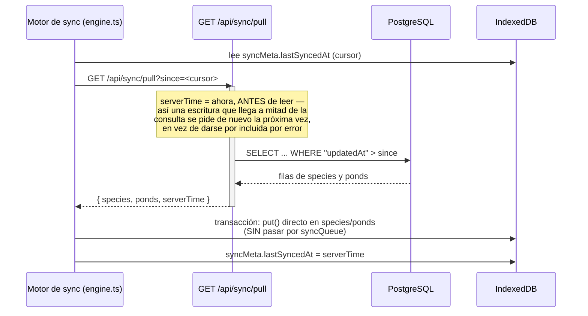
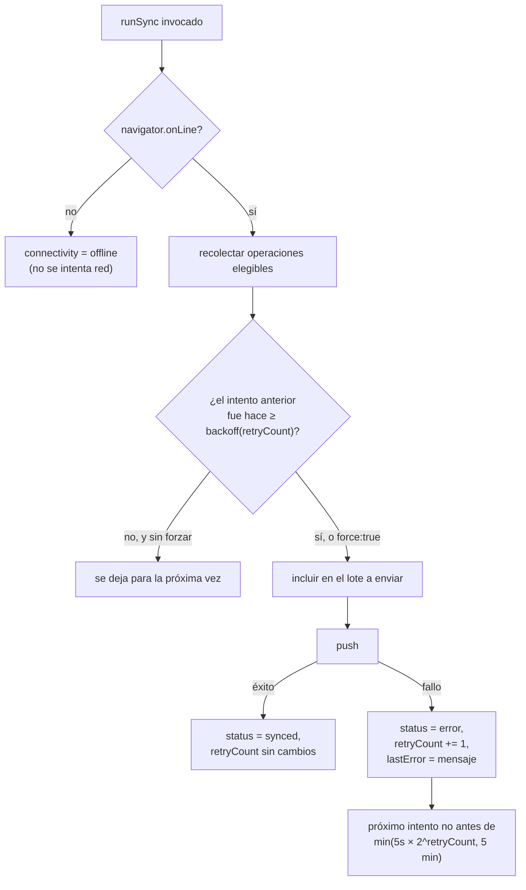
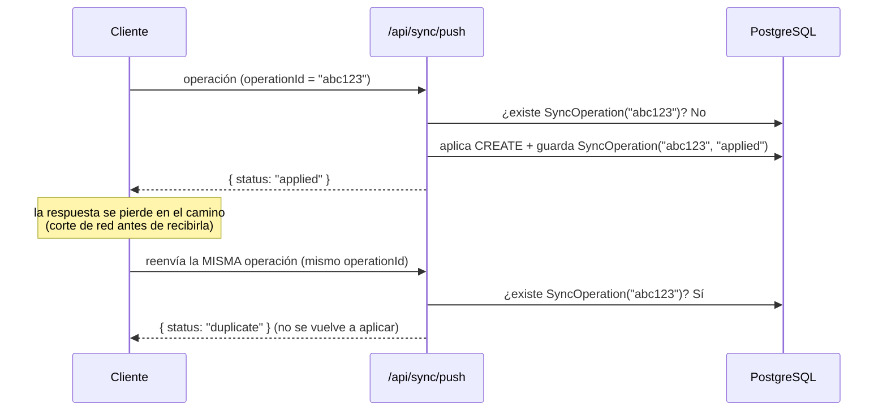
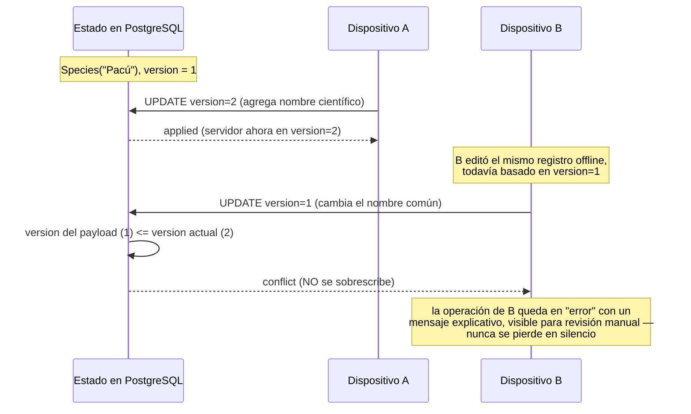
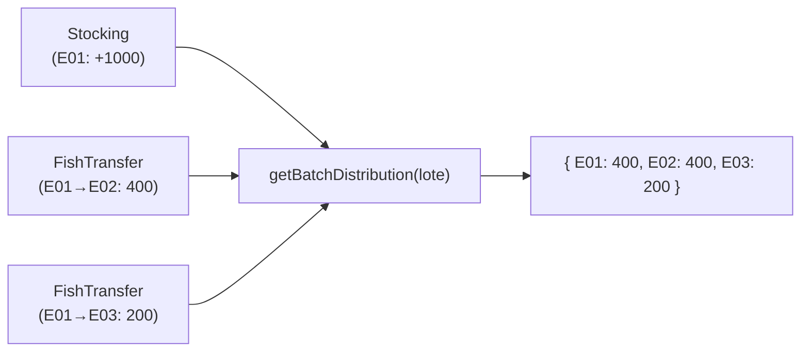
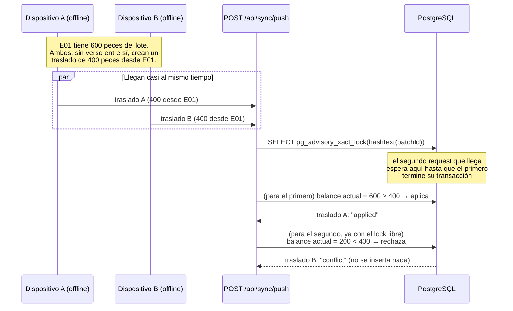
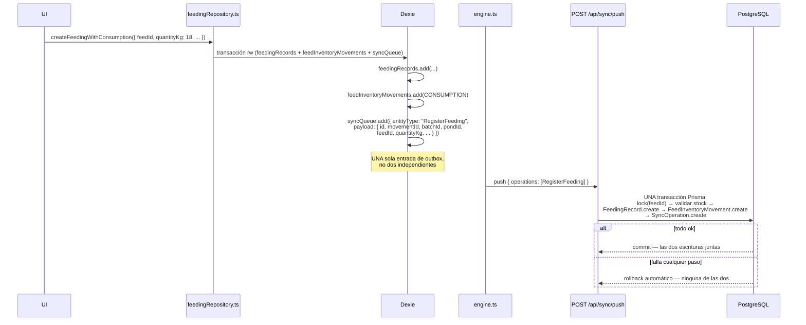
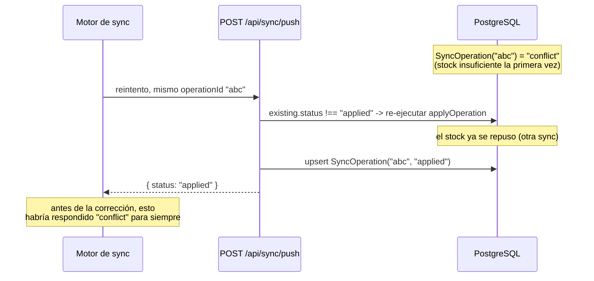

# OFFLINE_SYNC.md

Cómo funciona, en detalle, el modo offline-first y la sincronización de
esta aplicación. Complementa `IMPLEMENTATION_PLAN.md` §5-§6 (el diseño) y
`ARCHITECTURE.md` (dónde vive cada pieza en el código).

## 1. Escritura offline

Ninguna pantalla espera nunca a la red para guardar algo. El flujo es
siempre el mismo, sea cual sea la entidad:

```mermaid
sequenceDiagram
    participant UI as Página (ej. /especies)
    participant Repo as Repositorio (src/lib/db/repositories)
    participant Dexie as IndexedDB (Dexie)

    UI->>Repo: createSpecies({ commonName: "Pacú" })
    activate Repo
    Note over Repo: genera id (UUID v4),<br/>deviceId, timestamps, version=1
    Repo->>Dexie: transacción rw (species + syncQueue)
    activate Dexie
    Dexie->>Dexie: species.add(registro)
    Dexie->>Dexie: syncQueue.add({ operationId, entityType,<br/>entityId, operation: "CREATE", payload, status: "pending" })
    Dexie-->>Repo: transacción confirmada (ambas escrituras o ninguna)
    deactivate Dexie
    Repo-->>UI: registro creado
    deactivate Repo
    Note over UI: useLiveQuery ya refleja el cambio;<br/>no hubo ninguna llamada de red
```

Las tres operaciones (crear, actualizar, eliminar lógicamente) comparten
esta misma garantía en `src/lib/db/repositories/base.ts`: la escritura de
dominio y su entrada en `syncQueue` ocurren en **una sola transacción
Dexie**. Si el navegador se cierra a mitad de camino, Dexie asegura que se
aplicó todo o nada — nunca queda un dato guardado sin su operación de
sincronización pendiente.

## 2. Push (enviar cambios locales al servidor)

```mermaid
sequenceDiagram
    participant Engine as Motor de sync (engine.ts)
    participant API as POST /api/sync/push
    participant Prisma as Prisma (transacción)
    participant PG as PostgreSQL

    Engine->>Engine: recolecta operaciones "pending"/"error"<br/>listas para reintentar (respeta backoff)
    Engine->>Dexie: marca esas operaciones como "syncing"
    Engine->>API: { deviceId, operations: [...] }
    activate API
    API->>API: valida cada operación con Zod
    loop por cada operación
        API->>Prisma: ¿existe SyncOperation con este operationId?
        alt ya existe
            Prisma-->>API: sí → "duplicate" (no se reaplica)
        else no existe
            API->>Prisma: transacción: aplicar CREATE/UPDATE/DELETE<br/>+ crear SyncOperation(operationId, status)
            Prisma->>PG: escribe
            PG-->>Prisma: ok
            Prisma-->>API: "applied" (o "conflict", ver §5)
        end
    end
    API-->>Engine: { results: [{ id, status }], serverTime }
    deactivate API
    Engine->>Dexie: "applied"/"duplicate" → synced;<br/>"conflict"/"error" → error (con mensaje)
    Engine->>Dexie: purga las operaciones "synced"
```

## 3. Pull (traer cambios del servidor)



**Por qué el pull no pasa por `syncQueue`**: si un registro que acaba de
llegar del servidor se volviera a encolar como si fuera un cambio local,
el dispositivo se lo reenviaría al servidor en el próximo push —
generando tráfico inútil como mínimo, y en el peor caso un bucle. `put()`
directo sobre las tablas de Dexie evita esto por construcción.

Es además **incremental**: nunca se descarga la base completa, solo lo
que cambió desde el cursor guardado (§58 del encargo: rendimiento).

## 4. Reintentos y backoff



- Cada operación se intenta **como máximo una vez por llamada a
  `runSync`** — nunca hay un bucle interno que reintente hasta tener
  éxito. Los reintentos vienen de que algo vuelve a llamar a `runSync`
  más tarde: el intervalo periódico (cada 60 s), el evento `online` del
  navegador, o el botón "Sincronizar ahora" (que además fuerza a ignorar
  el backoff con `force: true`). Esto evita que un fallo persistente de
  red pueda causar un bucle infinito.
- El dato **nunca se pierde** por un fallo de sincronización: sigue en
  IndexedDB, visible y editable, con su badge en 🟠/🔴 indicando que
  falta enviarlo.

## 5. Idempotencia

El requisito crítico: reenviar la misma operación (por un corte de
conexión a mitad de la respuesta, por ejemplo) nunca debe duplicar su
efecto.



`operationId` es, en el cliente, el mismo `id` de la entrada en
`syncQueue` — estable mientras esa operación no se haya confirmado
sincronizada, sin importar cuántas veces se reintente. En el servidor,
`SyncOperation.operationId` tiene una restricción `UNIQUE`: si dos
solicitudes con el mismo `operationId` llegaran en paralelo, la base de
datos rechaza la segunda inserción por la restricción única — no hay
ninguna ventana de carrera donde ambas puedan aplicarse. Verificado con
un test real (no solo unitario): la misma operación de creación enviada
tres veces contra un PostgreSQL real deja exactamente una fila (ver
`src/app/api/sync/__tests__/sync.integration.test.ts` y
`tests/e2e/offline.spec.ts`, paso 5).

## 6. Conflictos

Estrategia: **last-write-wins por número de versión**, nunca por
timestamp (los relojes de dispositivos no son confiables).



Este mecanismo solo importa para entidades con campos editables
(`Species`, `Pond` en esta fase). Los movimientos productivos/económicos
del dominio completo (alimentación, mortalidad, ventas...) se diseñan
como registros *append-only* (§8/§77 del encargo): al no editarse nunca,
prácticamente no generan conflictos de contenido — ver
`IMPLEMENTATION_PLAN.md` §4.1 y §6.4.

## 7. Qué pasa si el servidor está caído (no el dispositivo)

Desde el punto de vista del cliente es indistinguible de estar offline:
`fetch()` falla, la operación queda en `error` con backoff, y el dato
sigue intacto en IndexedDB. En cuanto el servidor vuelve a responder, el
siguiente intento (automático o manual) la sincroniza con normalidad —
sin ninguna acción especial de recuperación. Verificado en
`tests/e2e/offline.spec.ts` (paso 6), interceptando y luego liberando las
solicitudes a `/api/sync/push` para simular una caída y recuperación
reales del servidor.

## 8. Modelo de producción piscícola (Fase 2)

La Fase 2 añade Lotes (`FishBatch`), Siembras (`Stocking`) y Traslados
(`FishTransfer`) sobre la misma arquitectura offline-first de las
secciones anteriores. El principio nuevo que gobierna todo este modelo:
**nunca existe un campo mutable que diga "cuántos peces hay en tal
estanque ahora"**. Ese número siempre se calcula, nunca se guarda.

### 8.1 Ledger append-only, no un contador

`Stocking` y `FishTransfer` son tablas *append-only*: se crean, nunca se
editan ni se les cambia el estanque. Un lote (`FishBatch`) no tiene
`currentPondId` ni `currentQuantity` — solo guarda sus datos de alta
(especie, siembra inicial, biomasa inicial). Dónde está el lote *ahora*
se deriva combinando su historial completo de siembras y traslados:



Esto es exactamente lo que exige un traslado **parcial**: un mismo lote
puede terminar repartido entre varios estanques a la vez, así que
"estanque actual del lote" no es una pregunta con una sola respuesta —
por eso nunca se modeló como un campo único.

Las funciones que hacen este cálculo viven en `src/lib/domain/batchLedger.ts`
— puras, sin dependencias de Dexie ni de Prisma — y se usan **idénticas**
en tres sitios: la UI cliente (contra Dexie), `_lib/applyOperation.ts` en
el servidor (contra el estado ya aplicado en la transacción Prisma, para
validar un traslado entrante) y los tests. Una sola implementación del
ledger, nunca dos lógicas de negocio que puedan divergir:

- `getBatchPondBalance(stockings, transfers, batchId, pondId)` — peces de
  un lote en un estanque concreto, ahora mismo.
- `getBatchDistribution(stockings, transfers, batchId)` — el lote
  repartido entre todos los estanques donde tiene peces.
- `getBatchTotalBalance(stockings, transfers, batchId)` — total del lote
  (invariante frente a traslados: solo cambia si se registra una nueva
  siembra o, en fases futuras, una cosecha/mortalidad).
- `getPondOccupancy(stockings, transfers, pondId)` — a la inversa: qué
  lotes hay en un estanque dado, un estanque puede alojar varios.

Diseñado para extenderse sin romper la API interna: cuando la Fase 3
añada mortalidad o cosecha, esas tablas append-only se sumarán al mismo
cálculo de balance (`disponible = siembras − traslados_salida +
traslados_entrada − mortalidad − cosecha`) sin cambiar la firma de estas
funciones ni el modelo de `FishBatch`.

### 8.2 Validación de balance: nunca sacar más de lo disponible

Un traslado nunca puede sacar del origen más peces de los que hay. Se
valida en dos capas, porque el cliente nunca es la fuente de verdad:

1. **Cliente** (`src/lib/db/repositories/fishTransferRepository.ts`):
   antes de escribir en Dexie, calcula el balance actual del estanque de
   origen con `getBatchPondBalance` y rechaza la operación (sin tocar la
   base local, sin encolarla) si `cantidad > disponible`. Esto es lo que
   hace posible el preview "Disponibles en origen / Trasladar / Quedarán"
   de `/lotes/[id]` — calculado en el cliente, sin ningún round-trip de
   red.
2. **Servidor** (`src/app/api/sync/_lib/applyOperation.ts`): vuelve a
   calcular el balance, esta vez contra el estado real ya confirmado en
   Postgres, dentro de la misma transacción que va a insertar el
   traslado. Un dispositivo desactualizado (que offline no vio los
   traslados que otro dispositivo ya sincronizó) puede enviar una
   operación que el cliente creyó válida y que el servidor debe rechazar
   igual — ver §8.3.

### 8.3 Conflictos multi-dispositivo: bloqueo real, nunca perder ni inventar datos

Este es un tipo de conflicto distinto del *last-write-wins* de §6 (que
es para campos editables como el nombre de una especie). Aquí dos
dispositivos, cada uno offline del otro, pueden creer — con datos
igualmente válidos en el momento en que los vieron — que ambos pueden
trasladar más peces de los que en conjunto hay disponibles.



- El candado es un **advisory lock de Postgres**
  (`pg_advisory_xact_lock(hashtext(batchId)::bigint)`), tomado al
  principio de la transacción que procesa un `FishTransfer` y liberado
  automáticamente al hacer commit o rollback. Serializa, por lote, las
  operaciones de traslado concurrentes — dos requests HTTP simultáneos
  para el mismo lote nunca pueden los dos leer el mismo balance "antes"
  del traslado del otro.
- El resultado del que pierde la carrera es `status: "conflict"`, **no**
  un error genérico ni un éxito silencioso: la operación queda registrada
  como conflicto, nunca se inserta la fila de `FishTransfer`, y en el
  dispositivo que la generó queda visible en estado `error` (mismo
  mecanismo del §4) — nadie pierde el traslado en silencio, pero tampoco
  se inventa una cantidad negativa para que "encaje". La persona
  responsable ve que ese traslado necesita revisión manual (por ejemplo,
  reducir la cantidad o cancelarlo) en cuanto vuelve a mirar el
  dispositivo.
- Verificado con una prueba de concurrencia real, no simulada en
  secuencia: dos invocaciones HTTP al mismo route handler lanzadas con
  `Promise.all` contra el mismo lote, mismo estanque de origen, cantidad
  que en conjunto excede lo disponible — el resultado es siempre exactamente
  una `"applied"` y una `"conflict"`, nunca las dos aplicadas ni las dos
  rechazadas, corrido varias veces para descartar flakiness (ver
  `src/app/api/sync/__tests__/fishTransfer.integration.test.ts`).

### 8.4 Código de lote: único, generado offline, sin depender del servidor

Un lote necesita un código legible (`PAC-2026-001-9B1C`) sin poder
coordinarse con el servidor para obtener un consecutivo global — dos
dispositivos offline creando lotes de Pacú el mismo año no pueden
"pedir turno". La solución (`src/lib/domain/batchCode.ts`) es un
esquema híbrido: prefijo de la especie (3 letras, sin acentos) + año +
secuencia local (por dispositivo, incremental) + sufijo corto derivado
del `deviceId`. La secuencia local hace que el código sea legible y casi
consecutivo dentro de un mismo dispositivo; el sufijo del dispositivo
garantiza que dos dispositivos nunca puedan generar el mismo código
aunque coincida especie, año y secuencia — sin sacrificar la capacidad
de crear lotes completamente offline, que era el requisito no
negociable.

## 9. Operación diaria: alimento, mortalidad y muestreos (Fase 3)

### 9.1 Ledger de inventario de alimento

Mismo principio que el ledger de peces: `Feed` **nunca** tiene un
campo `stockKg`. El stock se deriva siempre de `FeedInventoryMovement`
(append-only), con `quantityKg` guardado siempre positivo y el signo
decidido por `movementType` en una única función,
`getFeedMovementSignedQuantity` (`src/lib/domain/feedLedger.ts`):
entradas (`PURCHASE`, `INITIAL_STOCK`, `ADJUSTMENT_IN`, `RETURN`) suman;
salidas (`CONSUMPTION`, `ADJUSTMENT_OUT`, `LOSS`) restan. `getFeedStock`
sencillamente suma esos movimientos — ninguna pantalla reimplementa la
regla del signo.

### 9.2 FeedingRecord ↔ FeedInventoryMovement

Registrar alimentación escribe **dos** filas ligadas en una sola
transacción local (`createFeedingWithConsumption`,
`src/lib/db/repositories/feedingRepository.ts`): el `FeedingRecord`
(el evento descriptivo — quién, cuándo, cuánto, en qué estanque/lote) y
un `FeedInventoryMovement` tipo `CONSUMPTION` con
`sourceType: "FEEDING"` y `sourceId` apuntando al `FeedingRecord`. Esa
vinculación es la que responde "¿por qué bajó el stock?" sin tener que
adivinar.

Desde la Fase 3.5, esas dos escrituras se sincronizan como **un único
comando de negocio** (`RegisterFeeding`), aplicado en una sola
transacción de servidor — ver §10 para el diseño completo y por qué el
enfoque anterior (dos operaciones independientes) era un riesgo real de
consistencia, no solo teórico. La restricción única
`@@unique([sourceType, sourceId])` de `FeedInventoryMovement`
(`prisma/schema.prisma`) se mantiene como defensa adicional ante un
futuro bug, no como el mecanismo principal — ese ahora es la
atomicidad de la transacción compuesta.

### 9.3 Validación de stock: cliente y servidor

Antes de escribir, el cliente calcula el stock disponible con
`getFeedStock` sobre los movimientos ya en Dexie y rechaza el registro
si `cantidad > disponible`, sin tocar la base local
(`No hay suficiente alimento disponible. Stock actual: X kg.`). El
servidor repite la validación contra el estado real de Postgres dentro
de la transacción que va a insertar el movimiento — mismo criterio que
los traslados de peces en Fase 2.

### 9.4 Conflictos multi-dispositivo de inventario

Idéntico patrón al de traslados de peces (§8.3), aplicado a alimento:
un advisory lock de Postgres por `feedId`
(`pg_advisory_xact_lock(hashtext(feedId)::bigint)`) serializa los
movimientos de SALIDA concurrentes del mismo alimento —las de ENTRADA
nunca pueden dejar el stock negativo, así que no necesitan lock. Dos
consumos concurrentes que en conjunto superarían el stock disponible
nunca terminan ambos aplicados: uno gana la carrera (`"applied"`), el
otro pierde (`"conflict"`, no se inserta nada, el dato sigue en el
outbox del dispositivo que lo generó para revisión). Verificado con un
test de concurrencia real —dos invocaciones HTTP en paralelo, no
secuenciales— en
`src/app/api/sync/__tests__/dailyOperations.integration.test.ts`.

Mortalidad usa el mismo mecanismo pero reutilizando el lock por
`batchId` que ya existía para traslados: un registro de mortalidad es,
para el ledger de peces, una salida más del estanque donde ocurrió
(§8.1), así que comparte candado y validación de balance con
`FishTransfer`.

### 9.5 Peso estimado, biomasa y supervivencia

El peso promedio de un lote **nunca** se guarda como un valor mutable.
`getEstimatedWeightForPond` (`src/lib/domain/sampling.ts`) toma el
muestreo más reciente de la combinación exacta `batchId`+`pondId`; si
todavía no hay ninguno, cae al peso inicial de la siembra del lote. Un
muestreo en un estanque **no** sustituye el peso estimado de otro
estanque donde está el mismo lote — cada componente de la biomasa se
calcula con su propio peso antes de sumarse
(`getBatchProductionSummary`, `src/lib/domain/productionSummary.ts`):
nunca `cantidad total del lote × un único peso`.

Supervivencia % = peces actuales / peces sembrados × 100; mortalidad %
= mortalidad acumulada / peces sembrados × 100 — ambas con `null`
explícito (no división por cero) cuando no hay siembra registrada
(`getSurvivalPercent`/`getMortalityPercent`, `batchLedger.ts`).

### 9.6 Crecimiento y FCR: siempre "estimado", nunca falsa precisión

Crecimiento y FCR (`src/lib/domain/growth.ts`, `fcr.ts`) se calculan
entre los **dos muestreos más recientes** del lote. El alimento
consumido se acota estrictamente a ese intervalo de fechas —nunca se
mezcla alimento de fuera del período—, y el incremento de biomasa usa
la cantidad **actual** del lote multiplicada por la diferencia de peso
entre ambos muestreos (`totalNow × (pesoActual - pesoAnterior) / 1000`),
una simplificación documentada: no reconstruye la cantidad exacta que
había en cada fecha pasada, así que no descuenta con precisión la
biomasa de los peces que murieron a mitad del período. Por eso
`calculateFcr` siempre marca `estimated: true` y la UI siempre rotula
"FCR estimado" — nunca se presenta como un valor contable exacto. Con
menos de dos muestreos comparables, ambos cálculos devuelven
"Datos insuficientes" en vez de un número inventado o `Infinity`/`NaN`.

### 9.7 Orden de sincronización de operaciones dependientes

Ver §10.5 — desde la Fase 3.5, el orden de envío es explícito
(`getSyncPriority`/`selectReadyOperations`), no una consecuencia
incidental de `createdAt`. Esta subsección describía el diseño de la
Fase 3 (ordenar solo por `createdAt` y confiar en el reintento ante un
empate); se mantiene aquí solo como referencia histórica de qué
riesgo motivó el cambio — ver §10.5 para el mecanismo vigente.

### 9.8 Operaciones atómicas locales y en servidor

Ver §10.1-§10.2 — desde la Fase 3.5, una creación compuesta
(alimentación+consumo, alimento+stock inicial) se sincroniza como
**un único comando de negocio**, aplicado en una sola transacción de
servidor: nunca puede quedar aplicada una escritura sin la otra. Esta
subsección describía el diseño de la Fase 3 (dos operaciones
independientes, cada una en su propia transacción); se mantiene aquí
solo como referencia histórica de qué riesgo motivó el cambio — ver
§10 para el diseño vigente y por qué el riesgo era real, no solo
teórico.

## 10. Fase 3.5 — Hardening: comandos de negocio compuestos, orden determinista y recuperación de fallos

Antes de esta fase, "registrar alimentación" se sincronizaba como
**dos** operaciones independientes (`FeedingRecord` CREATE +
`FeedInventoryMovement` CREATE), cada una en su propia transacción de
servidor. El riesgo no era hipotético: un fallo entre las dos (caída
del servidor, corte de red a mitad del segundo `push`, un error real
de Postgres) podía dejar un `FeedingRecord` sin su movimiento de
inventario, o viceversa — el ledger de alimento (§9.1) se construye
solo a partir de `FeedInventoryMovement`, así que un `FeedingRecord`
huérfano no rompía el stock, pero un `FeedInventoryMovement` huérfano
(sin su `FeedingRecord`) sí dejaba un movimiento de consumo sin
ninguna explicación de negocio visible. Lo mismo aplicaba a "crear
alimento con stock inicial" (`Feed` + `FeedInventoryMovement`
`INITIAL_STOCK`). Esta sección documenta cómo se cerró ese riesgo, sin
depender solo del reintento para mantenerlo cerrado.

### 10.1 Comandos de negocio compuestos como entidades del protocolo

En vez de que el cliente encole dos operaciones de sync por cada
acción de usuario, encola **una sola**, con un `entityType`
pseudo-entidad que no mapea 1:1 a una tabla de Prisma sino a un
handler de servidor que escribe varias tablas:

| Comando de negocio | Encola en vez de | Escribe (servidor) |
|---|---|---|
| `RegisterFeeding` | `FeedingRecord` + `FeedInventoryMovement` | `FeedingRecord` + `FeedInventoryMovement` (CONSUMPTION) |
| `CreateFeedWithInitialStock` | `Feed` + `FeedInventoryMovement` | `Feed` + `FeedInventoryMovement` (INITIAL_STOCK) |

Sin stock inicial, `createFeed` sigue encolando un `Feed` CREATE
simple — no hay nada compuesto que proteger cuando no hay una segunda
escritura.

El `id` del comando es el de la entidad **principal** que crea (el
`FeedingRecord`/el `Feed`) — es también el `entityId` de la operación,
así que el resto del protocolo (pull, `SyncOperation.entityId`) no
necesita distinguir un comando compuesto de una entidad simple.



### 10.2 Garantía de atomicidad

`applyRegisterFeedingOperation` y `applyCreateFeedWithInitialStockOperation`
(`src/app/api/sync/_lib/applyOperation.ts`) hacen sus dos escrituras
dentro del `tx` que **ya** les pasa `processOperation`
(`src/app/api/sync/push/route.ts`) — el mismo `prisma.$transaction`
que también registra el `SyncOperation`. Si cualquier paso falla
(validación, un error real de Postgres), Prisma revierte
automáticamente **todo** lo que la transacción llevaba escrito hasta
ese punto — nunca queda un `FeedingRecord` sin su movimiento, nunca un
movimiento sin su `FeedingRecord`.

Esto no es una promesa de diseño sin verificar: `applyFishTransferOperation`
y `applyMortalityRecordOperation` (Fase 2/3) ya tenían esta misma
propiedad por construcción — cada handler de `applyOperation` recibe
el `tx` compartido con el registro de `SyncOperation`, así que lock +
validación de balance + creación + `SyncOperation` siempre estuvieron
en una sola transacción para *toda* entidad. El riesgo real y
específico de la Fase 3.5 era el patrón de **dos operaciones
separadas** para una sola acción de usuario (§10 arriba) — no una
falla de atomicidad dentro de cada operación individual.

Probado con un fallo **real** de Postgres, no un mock: se planta de
antemano una fila con el mismo id que usará el segundo `create()` de
la transacción (el `FeedInventoryMovement`, o para `FishTransfer`/
`MortalityRecord`, la propia entidad), forzando una violación de
llave primaria a mitad de la transacción. El resultado siempre es
`"error"`, con cero filas nuevas y el stock/balance sin cambios — ver
`src/app/api/sync/__tests__/registerFeeding.integration.test.ts` (§17),
`fishTransfer.integration.test.ts` y `dailyOperations.integration.test.ts`.

### 10.3 Idempotencia del comando compuesto

Como ahora es **una** operación con **un** `operationId` (en vez de
dos), la restricción `UNIQUE` de `SyncOperation.operationId` (§5) por
sí sola cierra "reenviar tras perder la respuesta nunca duplica":
reintentar `RegisterFeeding` tres veces deja exactamente un
`FeedingRecord`, un `FeedInventoryMovement` y el stock descontado una
sola vez — no hace falta ningún mecanismo nuevo, solo menos
operaciones que mantener sincronizadas entre sí. Verificado en
`registerFeeding.integration.test.ts` (§16 y el test de
`CreateFeedWithInitialStock` + retry).

### 10.4 Compatibilidad con datos y outbox existentes

`syncEntityTypeSchema` conserva `"FeedingRecord"`, `"FeedInventoryMovement"`
y `"Feed"` como valores válidos (`src/lib/validation/sync.ts`) — sus
handlers de servidor (`applyFeedingRecordOperation`,
`applyFeedInventoryMovementOperation`, `applyFeedOperation`) siguen
existiendo sin cambios. El código cliente nuevo simplemente deja de
*emitir* esos entityTypes por separado; cualquier entrada ya encolada
en el outbox de un dispositivo con la versión anterior de la app
(offline desde antes de esta actualización) sigue sincronizando con
normalidad la próxima vez que se conecte, sin ninguna migración de
Dexie. No se transforma el outbox pendiente ni los datos ya
sincronizados — nunca se destruye IndexedDB por este cambio. Tampoco
hizo falta ninguna migración de Prisma: `RegisterFeeding` y
`CreateFeedWithInitialStock` son comandos a nivel de protocolo de
sincronización, no tablas nuevas — las tablas `Feed`,
`FeedInventoryMovement` y `FeedingRecord` no cambiaron.

### 10.5 Orden de sincronización determinista

Antes de esta fase, el outbox se enviaba ordenado solo por
`createdAt` (§9.7 histórico). Suficiente casi siempre porque la UI
solo deja elegir una entidad ya guardada, pero no una garantía
explícita: dos operaciones con el mismo timestamp (una creación
compuesta encola varias casi simultáneas) podían enviarse en el orden
equivocado, y el primer sync de un dispositivo que trabajó offline
mucho tiempo antes de conectarse dependía de esa coincidencia de
timestamps para no generar errores de llave foránea evitables.

`src/lib/sync/priority.ts` reemplaza ese orden implícito por uno
explícito, basado en las relaciones reales de `prisma/schema.prisma`:

| Nivel | Entidades | Depende de |
|---|---|---|
| 1 | `Species`, `Pond`, `Feed`, `CreateFeedWithInitialStock` | nada |
| 2 | `FishBatch` | `Species` |
| 3 | `Stocking` | `FishBatch` + `Pond` |
| 4 | `FishTransfer`, `MortalityRecord`, `Sampling`, `FeedInventoryMovement`, `FeedingRecord`, `RegisterFeeding` | `FishBatch`/`Pond`/`Feed` (y su validación de balance necesita que `Stocking` ya se haya aplicado) |

`getSyncPriority(entityType)` da el nivel; `getDependencyEntityIds`
extrae del payload los ids de los que depende cada operación (p. ej.
`RegisterFeeding` depende de `batchId`, `pondId`, `feedId`).
`selectReadyOperations` ordena por `[nivel, createdAt, id de la
operación]` — el `id` como desempate final asegura que el orden sea
100% determinista incluso ante un empate exacto de `createdAt`, nunca
dependiendo de que dos timestamps generados por separado coincidan o
no. `engine.ts`'s `collectEligibleOperations` la usa en vez del `sort`
plano anterior.

Esto **no sustituye** idempotencia/retries/backoff (§10.6): siguen
siendo necesarios para fallos de red genuinos y para el caso raro de
empate dentro de un mismo nivel. El orden solo reduce cuántas veces
hace falta ese reintento en el camino feliz — de "casi siempre, salvo
empate" (Fase 3) a "siempre, salvo un fallo de red genuino" (Fase
3.5).

Verificado con un dataset completo creado offline (Species → Pond ×2
→ FishBatch → Stocking → alimento con stock inicial → alimentación →
mortalidad → muestreo → traslado), con los timestamps deliberadamente
en el orden **inverso** al de las dependencias reales — para no
depender por accidente de que el reloj local avance en el mismo
sentido que las dependencias. En el orden que produce
`selectReadyOperations`, el primer sync se aplica completo, sin un
solo error de llave foránea; el mismo dataset, enviado en el orden
ingenuo por `createdAt`, sí produce errores — confirmando que el
cambio cierra un riesgo real, no cosmético. Ver
`src/app/api/sync/__tests__/syncOrder.integration.test.ts` (§21).

### 10.6 Prevención de inundación: un padre en error retiene a sus hijos

`selectReadyOperations` también excluye del lote actual cualquier
operación cuya dependencia tenga **actualmente** una entrada en estado
`"error"` en el outbox — para no gastar solicitudes HTTP en hijos que
se sabe que van a fallar mientras su padre siga fallando. Es
deliberadamente simple, tal como pedía el encargo ("no hace falta
construir un scheduler complejo"): un filtro de un solo paso, no
transitivo, sobre una lista ya cargada en memoria — no reintenta, no
espera, no mantiene estado entre llamadas.

- Un padre **`"pending"`** (nunca se intentó, o es la primera vez)
  **no** bloquea a su hijo: gracias al orden explícito de §10.5, el
  padre va antes en el mismo lote y `push/route.ts` los procesa uno a
  uno dentro de la misma solicitud — para cuando le toca al hijo, el
  padre ya se aplicó.
- Un padre **`"error"`** sí bloquea a su hijo, hasta que el padre se
  reintente con éxito en un ciclo posterior de `runSync`.

Límite documentado, aceptado a propósito: el filtro no es transitivo
(un abuelo en error no bloquea a un nieto cuyo padre nunca llegó a
intentarse), así que en el peor caso una cadena de dependencia
profunda genuinamente rota puede gastar una solicitud extra por nivel
en un mismo ciclo de sync — se autocorrige solo en el siguiente ciclo
(el hijo intentado pasa a `"error"` y ahí sí queda bloqueado), nunca
es un bug de pérdida o duplicación de datos. Ver
`src/lib/sync/__tests__/priority.test.ts`.

### 10.7 Recuperación después de fallos parciales: el reintento tiene que reevaluar, no solo repetir

Al escribir las pruebas de §10.5 se encontró un problema real en
`processOperation` (`src/app/api/sync/push/route.ts`), previo a esta
fase: la comprobación de idempotencia trataba **cualquier** fila
existente de `SyncOperation` para un `operationId` como definitiva,
sin importar su estado — no solo `"applied"`. Un operationId que
había quedado en `"conflict"` (por ejemplo, stock insuficiente en ese
momento) o en `"error"` (por ejemplo, el `FishBatch` padre todavía no
había sincronizado) quedaba bloqueado **para siempre**: el motor de
sync seguía reintentando esa entrada del outbox con backoff, pero el
servidor respondía siempre con el mismo estado guardado, sin volver a
ejecutar `applyOperation` — nunca se re-evaluaba si el stock ya se
había repuesto o si el padre ya existía.

Esto contradecía directamente el propio principio de esta fase (§13
del encargo: "el orden no sustituye al retry — el retry recupera
fallos transitorios"): un reintento que nunca vuelve a evaluar nada no
es un reintento.

**Corrección**: `processOperation` ahora solo corta en seco cuando el
estado existente es `"applied"` (el único caso realmente terminal —
ya se aplicó, nunca se vuelve a tocar la base para ese
`operationId`). Para `"conflict"`/`"error"`, vuelve a ejecutar
`applyOperation` dentro de una nueva transacción y actualiza (`upsert`,
no `create`) la fila de `SyncOperation` existente con el resultado
**actual**. Esto es seguro porque ya estaba probado que ni `"conflict"`
ni `"error"` dejan ninguna escritura de dominio a medias (§10.2): no
hay nada que "deshacer" antes de reintentar.



Verificado en `src/app/api/sync/__tests__/syncOrder.integration.test.ts`
(§22): una mortalidad y un traslado que fallan en `"conflict"` porque
su `Stocking` padre todavía no sincronizó (simulando una solicitud
perdida) se reintentan con el mismo `operationId` una vez el padre
existe, y esta vez sí quedan `"applied"` — sin duplicar ni perder
ninguna otra operación del mismo lote.

### 10.8 Mensajes de conflicto comprensibles por operación

Un conflicto de un comando de negocio compuesto (`RegisterFeeding`,
`FeedInventoryMovement`, `FishTransfer`, `MortalityRecord`) no es un
conflicto de "versión más reciente" (last-write-wins, §6 — el único
caso real para `Species`/`Pond`/`FishBatch`/`Feed`): es un conflicto
de balance/stock — el dato local dejó de ser válido porque otro
dispositivo consumió el mismo stock o balance primero. Mostrar el
mensaje genérico de LWW ahí sería confuso.

`src/lib/sync/conflictMessages.ts` (`getConflictMessage`) construye un
mensaje específico por tipo de operación — por ejemplo, para
`RegisterFeeding`: *"No se pudo sincronizar la alimentación de 18 kg
porque el stock disponible cambió desde otro dispositivo."* — nunca
desglosado en dos incidentes separados ("Feeding falló" / "Inventory
falló"): la operación compuesta se presenta como **un** incidente
comprensible, igual que se registró como una única entrada de outbox.
`engine.ts` lo usa al marcar una operación en conflicto como error
local. Ver `src/lib/sync/__tests__/conflictMessages.test.ts` y el test
de `engine.test.ts` que confirma el mensaje específico llega hasta el
outbox local para una operación `RegisterFeeding` real.
